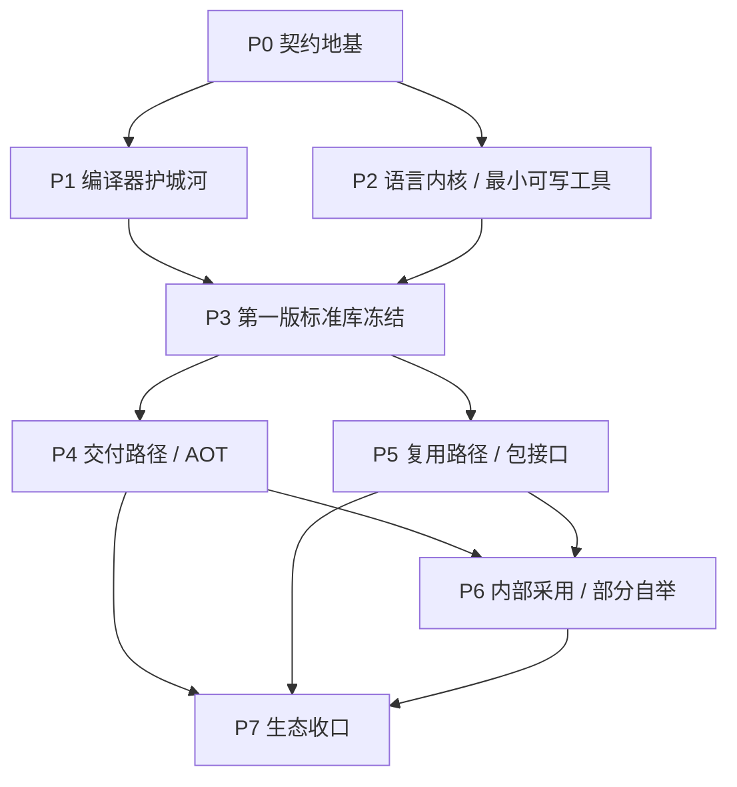

# AX 唯一路线基线（闭环计划书 v3）

> 本文件是 AX 项目的唯一方向依赖路径。
> 任何涉及路线、阶段、优先级、边界、是否继续推进某条主线的修改，都必须先更新本文件，再改代码、测试或其他文档。

最后更新：2026-04-27

## 文档职责

AX 根目录里和“项目推进”相关的文档，只保留三层：

- [`PLAN.md`](./PLAN.md)
  唯一方向文件。只回答“为什么做、先做什么、后做什么、什么时候切阶段”。
- [`WORKLIST.md`](./WORKLIST.md)
  当前待做细节清单。只回答“这几天具体在做什么”，并且每一项都必须挂靠到本文件的阶段编号。
- [`ARCHIVE.md`](./ARCHIVE.md)
  已完成事项归档。只记录已经完成的事项、产物和日期，不再承载未来规划。

除这三份外，其他根目录文档都不再定义路线：

- [`README.md`](./README.md) 负责对外介绍和入口
- [`PROJECT_FACTS.md`](./PROJECT_FACTS.md) 负责当前事实层
- [`SYNTAX.md`](./SYNTAX.md) 负责当前原型语法
- [`详细介绍.md`](./详细介绍.md) 负责实操命令与使用路径
- [`架构上下文文档.md`](./架构上下文文档.md) 负责上下文协议专题设计

一句话：

- `PLAN.md` 管方向
- `WORKLIST.md` 管待做
- `ARCHIVE.md` 管已做

## 1. 项目终局与当前基线

### 终局定义

AX 的终局是一门成熟的、面向自回归模型的 AI-first 工具语言。

它最终要同时成立四层能力：

- 语言本体：显式、低歧义、可规范化、能稳定承载真实工具程序
- 编译器与工具链：`check / run / fmt / build / context` 全部稳定，且长期可演进
- 标准库与生态：最小标准库、包接口、第三方扩展路径和跨平台支持完整成立
- AI 编译器护城河：结构化 diagnostics、repair contract、架构上下文协议和 benchmark 证据链成为主产品能力

AX 的路线不是“先做协议，再决定要不要做语言”，而是：

- 先把语言内核做成能稳定写工具的成熟方向
- 再把标准库、后端、包接口和生态逐层补齐
- 同时把 diagnostics / context / repair / benchmark 做成语言主线的编译器护城河

项目完成态定义为 `R3 Ecosystem Stable`：

- `axc check / run / fmt / build / context` 全部稳定
- AOT 是默认可发布路径
- 最小标准库、包接口、第三方库接口成立
- Linux 与 macOS 达到同一层级的 core support
- 部分自举成立，AX 不只写样例，也开始承载自己的工具与外围基础设施
- AX 对固定 cross-language 任务集有公开 benchmark 结果，而不是只做仓库内自证

### 当前源码基线

| 维度 | 当前状态 | 源码依据 |
| --- | --- | --- |
| 编译链 | 已打通 `Lexer -> Parser -> AST -> HIR -> MIR -> Semantic` | `src/frontend.rs` |
| 执行链 | 解释执行已是稳定主路径 | `src/interpreter.rs` |
| 外部接口 | `check / ast / hir / mir / build / run / fmt / context` 已成 CLI | `src/cli.rs` |
| 诊断协议 | 文本、`--json`、`--json --ai` 已成立 | `src/diagnostics.rs` `src/ai.rs` |
| 修复协议 | `rule_id / repair_goal / fixits / context_snippets` 已进入输出 | `src/ai.rs` |
| 上下文协议 | 七个对外视图 `overview / boundaries / topology / flow / symbol / impact / evidence` 已全部有命令和 JSON，对应六层语义协议 | `src/context.rs` |
| 项目模式 | `AX.toml + sources`、最小 `module/import` 已进入主线 | `src/project.rs` `src/parser.rs` `src/semantic.rs` |
| 代表样例 | 已有多组 project-backed 工具样例 | `examples/project_*` |
| benchmark | export / run / score / compare / smoke / CI 已落地 | `scripts/` `benchmarks/` |
| Repair Archaeology | 已登记为下一轮 P1 证据链展示层，尚未实现导出入口 | `docs/repair-archaeology.md` |
| build 后端 | 仍是骨架，只导出 `source/HIR/MIR/manifest`，`backend.status = pending` | `src/build.rs` |
| 平台 | Windows 全量、Linux 核心、macOS 未启动 | `.github/workflows/ci.yml` `docs/platform-support.md` |
| 本机环境 | 当前本机默认 MSVC `cargo test` 仍会被 `link.exe` 缺失卡住，但仓库已固定 GNU 本地验证路径并完成实测 | 当前本地验证结果 |

### 当前语法完成度判断

| 层级 | 完成度 | 说明 |
| --- | --- | --- |
| 最小可写工具内核 | `75%~80%` | 已有显式类型、数组/切片、`for/for in`、`break/continue`、最小 `match`、payload enum、模块第一刀、宿主 builtin |
| 通用语言表面 | `35%~40%` | 缺泛型、方法/impl、trait/interface、包系统、可见性、闭包、async、错误传播语法等 |
| 生态支撑语法 | `20%~30%` | 项目可组织，但还不能支撑完整标准库与第三方包生态 |

### 当前阶段判断

AX 当前不是“语法刚起步”的玩具仓库，但也还不是“已经完成发布级收口”的成熟语言产品。

当前最准确的判断是：

- `P0` 的环境与契约修复仍未完全收口，但 Windows 本地可复跑路径已经固定，剩余问题转向验证矩阵与外部契约收口
- `P1` 的 diagnostics / context / repair / benchmark 护城河已经有骨架，但还缺更公开、更可复现的消费层和展示层
- `P2` 的最小可写工具内核已经接近成型，但仍在依赖 `foundation/` 这一层孵化 helper，语言内核还没完全收口
- `P3+` 之后的标准库、AOT、包接口、自举和生态都还不该提前宣传成“已经在做的主线”

一句话：

> AX 现在处在“继续补语言内核、同步做硬编译器护城河、并为第一版标准库冻结准备接口”的阶段。

## 2. 闭环的定义与执行模型

### 语言优先与护城河关系

本计划的第一原则固定为：

- AX 的主产品始终是语言，不是 benchmark 项目，也不是单独的协议研究仓库
- `P2 / P3 / P4 / P5` 负责把语言内核、标准库、后端和生态路径推进到成熟语言方向
- `P1` 负责把 diagnostics / context / repair / benchmark 做成编译器护城河，用来放大语言主线的真实价值
- 如果 `P1` 和 `P2` 抢资源，默认优先回答“这件事是否直接提升语言可写性、标准库收口或工程组织能力”

一句话：

> AX 是语言优先，编译器护城河并进；不是拿证据链替代语言本体。

### 不是“一次性收官闭环”

本计划里的“闭环”，不是指现在就把整个项目一次性收死。
如果那样理解，后面每新增一项语法、标准库接口、包机制或后端能力，都等于整仓重做一遍闭环，代价会非常高。

AX 当前采用的是三层闭环：

- `阶段闭环`
  先让 `P0`、`P1`、`P2`、`P3` 这些阶段各自站稳，再往后推进
- `能力切片闭环`
  每新增一项语法、builtin、context 能力、标准库接口或 package 机制，只补这一条能力自身需要的闭环
- `总项目闭环`
  只有到 `P7` 收口阶段，才谈完整生态意义上的全项目闭环

一句话：

> 当前做的不是“全项目终局闭环”，而是“按阶段、按能力切片建立可复跑、可验证、可扩展的增量闭环”。

### 增量闭环的工作方式

后续任何新增能力，都按下面顺序推进：

1. 先判断它属于哪个阶段
2. 再判断它服务哪个真实缺口：代表样例、repair case、benchmark、标准库或包接口
3. 再只为这项能力补它自己的 parser / semantic / diagnostics / runtime / docs / snapshots / examples / benchmark
4. 最后把它接回已有主线，而不是重做整个项目

例如后续补 `match` 第二刀：

- 不需要把整个项目重新闭环一遍
- 只需要补 `match` 这条能力自己的语法闭环
- 然后回写到代表样例、AI diagnostics、修复链和回归链

### PLAN 和 WORKLIST 的分工关系

从现在开始，两份文档按下面方式严格对齐：

- [`PLAN.md`](./PLAN.md)
  定义：
  - 每个阶段为什么存在
  - 每个阶段的入口、出口和禁止事项
  - 每条语法线、标准库线、包接口线、后端线、自举线什么时候才允许启动
- [`WORKLIST.md`](./WORKLIST.md)
  负责：
  - 把当前激活阶段拆成可执行任务
  - 把 `PLAN` 里已经存在但阶段未到的队列登记为“已登记未激活”
  - 显式写清依赖、阻塞、当前顺序和完成标准

因此要求固定为：

- `PLAN` 里有而 `WORKLIST` 完全没有登记的主线，不允许长期存在
- `WORKLIST` 里正在做的事，必须能回挂到 `PLAN` 的阶段目标和出口条件
- `WORKLIST` 只激活当前阶段，但必须登记后续已确认主线，避免两份文档脱节

## 3. 总路线：从现在到项目收口的七阶段闭环

### 阶段连接方式

`P0 -> P7` 不是一条单线流水账。
更准确的连接方式是：

- `门槛阶段`
  负责给后续阶段提供稳定地基
- `能力阶段`
  负责把某一条主能力线做硬
- `并行阶段`
  在同一门槛之上展开两条不同方向的中线
- `汇合阶段`
  把前面的不同主线重新汇合成最终收口

AX 当前按下面这张图理解最准确：

一句话：

- `P0` 是地基
- `P1` 和 `P2` 是两条早期主线
- `P3` 是它们的第一次汇合
- `P4` 和 `P5` 是中期两条并行主线
- `P6` 是内部采用线
- `P7` 才是最终汇合收口

### 阶段承接矩阵

为了确保这些阶段不是硬串，而是真有依赖关系，下面这张表固定每一阶段“交付什么、服务谁”：

| 当前阶段 | 阶段类型 | 当前阶段必须交付什么 | 直接服务谁 |
| --- | --- | --- | --- |
| `P0` | 门槛阶段 | 本机可复跑路径、稳定 CLI 契约、稳定 diagnostics/context/build schema、统一文档口径 | 同时服务 `P1` 和 `P2` |
| `P1` | 能力阶段 | 可复跑 repair/benchmark 链、公开展示页、失败样例、context 输入位 | 给 `P2/P3` 提供“语言接口冻结后如何验证其价值”的证据与护城河输入 |
| `P2` | 能力阶段 | 固定代表样例、固定宿主边界样例、收紧后的 `foundation/`、真实能力缺口排序 | 给 `P3` 提供“语言内核和最小标准库到底该冻结哪些接口”的真实工作负载 |
| `P3` | 汇合门槛 | 第一版官方 `std.*` 接口、代表样例迁移结果、宿主边界与标准接口分离 | 同时服务 `P4` 和 `P5` |
| `P4` | 并行阶段 | 真实可执行 AOT 路径、build 产物契约、interpreter/AOT 对照回归 | 给 `P6` 和 `P7` 提供真实交付路径 |
| `P5` | 并行阶段 | path package、lockfile、registry contract、package diagnostics、AX package 边界 | 给 `P6` 和 `P7` 提供真实复用与生态路径 |
| `P6` | 汇合阶段 | AX 自写工具、AX 自写高层标准库逻辑、部分自举验证结果 | 给 `P7` 提供“AX 已能承载自己”的内部采用证据 |
| `P7` | 终局阶段 | 稳定生态、公共 benchmark、同级平台支持、长期治理模式 | 项目进入长期维护与生态治理 |

### 阶段切换的硬规则

从 `P0` 到 `P7` 一律遵守下面四条：

1. `P0` 完成前，不允许把 `P1` 或 `P2` 当成稳定主线对外表述。
2. `P1` 和 `P2` 可以并行推进，但都必须在 `P3` 前汇合，不能各自长成两套接口世界。
3. `P4` 和 `P5` 是并行阶段，不要求严格串行；它们共同依赖 `P3`，并共同服务 `P6/P7`。
4. `P6` 不是独立宇宙，它必须同时吃到 `P4` 的交付路径和 `P5` 的复用路径。
5. 如果某个新能力横跨两个阶段，先按更早阶段的要求闭环，再继续往后接。
6. `WORKLIST.md` 必须同时体现：
   - 当前激活阶段在做什么
   - 这些任务准备把什么交给下一阶段
   - 后续阶段哪些主线已经登记但未激活

### P0. 环境与契约修复阶段

**目标**：先修“我们自己是否能稳定验证自己”的问题。
**前置条件**：无。
**必须完成**：

- 固定 Windows 本地可复跑路径，至少有一条明确可用的 `cargo test` / `cargo build` 路线
- 明确本机和 CI 的差异，不允许“CI 绿、本地不可复跑”长期存在
- 继续冻结 CLI、diagnostics、context、build manifest 的外部契约

**退出条件**：

- 本地至少有一条正式支持的 Windows 构建/测试路径
- interface snapshots 与文档口径稳定
- `PLAN / WORKLIST / ARCHIVE / README / docs` 不再漂移

**禁止事项**：

- 不新增新命令面
- 不启动后端
- 不开启生态叙事

### P1. 编译器护城河与证据链阶段

**目标**：把 diagnostics / context / repair / benchmark 做成语言主线的编译器护城河，而不是只停留在独立协议层。
**前置条件**：P0 至少稳定到外部契约不再频繁漂移。
**必须完成**：

- repair benchmark 的 manifest、导出、运行、评分、对比、smoke 继续硬化
- 公开 benchmark 展示页、失败样例、方法说明
- 明确内部可复现结果与外部尚未证实结论的边界
- 让 `context` 开始进入 repair / benchmark 输入链，而不是只做独立视图
- 启动 `Repair Archaeology v0`，把已有 repair replay / score / compare 资产整理成可查询、可导出、可解释的修复证据对象

**退出条件**：

- 同一输入可重复得出同结构报告
- `base -> ai` 或 `cold -> base -> ai` 的仓库内差异可稳定复现
- context 已进入至少一条 repair/benchmark 消费链
- 至少一批 repair case 能导出 Markdown / JSON 形式的 archaeology 报告，且报告明确区分 replay 事实和 live-model 结论

**禁止事项**：

- 不夸大“已胜过 Rust/Go/Python 子集”
- 不为了宣传跳过失败样例
- 不把 `Repair Archaeology v0` 扩成 `axc generate`、真实 LLM 客户端、UI 项目或新语法系统

### P2. 语言内核与最小可写工具阶段

**目标**：把 AX 做成真的能稳定写工具的语言内核，而不是“看起来像会写工具”的原型表面。
**前置条件**：P0 已提供稳定契约；P1 至少已有足够可用的 diagnostics / repair / benchmark 基线来暴露真实缺口。
**必须完成**：

- 固化代表样例集：主代表样例 `3` 个，宿主边界样例 `2` 个
- 当前 `foundation` helper 收口，去掉临时性、一次性 helper
- 继续补最值钱的小缺口，但只能从代表样例与 repair case 暴露出来
- 建立“新增能力必须立即回写样例和回归链”的纪律

**退出条件**：

- 主代表样例均可稳定 `check / run / build`
- 宿主边界样例已明确承担 `process / env / path / fs` 验证职责
- 新能力不再靠临时 helper 托底

**禁止事项**：

- 不冲大语法面
- 不先做完整标准库
- 不做第三方包接口

### P3. 第一版官方最小标准库阶段

**目标**：把当前 `foundation` 从“项目内孵化层”升级成“官方最小工具标准库”，让语言主线第一次形成稳定接口面。
**前置条件**：P1 和 P2 都已达到第一轮稳定里程碑；也就是既知道“什么最值钱”，也知道“哪些接口真的被真实 workload 反复消费”。
**必须完成**：

- 冻结第一套官方命名空间，不再继续只用松散 `foundation/*`
- 把当前稳定 helper 归档为官方最小标准库接口
- 让代表样例迁移到统一的官方接口层
- 所有标准库接口都要对应 diagnostics、文档、示例和回归

**第一阶段正式标准库范围固定为**：

- `std.text`
- `std.cli`
- `std.fs`
- `std.path`
- `std.env`
- `std.process`
- `std.report`
- `std.workspace`
- `std.collections`，先只含 `string_list` 与后续最小 collections

**退出条件**：

- 至少 `5` 个 project-backed 样例使用同一套官方接口
- 标准库 API 在两个连续里程碑内无破坏性漂移
- 宿主 Rust builtin 与 AX 标准接口边界清晰

**禁止事项**：

- 不把 Rust crate 直接暴露成 AX 标准库
- 不把 `network / concurrency` 提前塞进官方标准库

### P4. AOT 后端阶段

**目标**：让 `build` 从骨架变成真实可执行产物路径。
**前置条件**：P3 完成，P1/P2 的证据链和代表样例稳定。
**执行顺序固定为**：

1. 冻结 HIR -> MIR 作为后端输入契约
2. 单文件 hello world AOT 打通
3. 至少 `3` 个代表项目样例 AOT 打通
4. build manifest 从 `planned_executable` 升级为真实 `executable`
5. 构建错误、回归链、平台产物契约定型

**退出条件**：

- AOT 可作为公开 v1 的正式发布路径
- 解释器仍保留为参考执行路径和语义对照路径
- build 不再被表述成 skeleton

**JIT 启动门槛**：

- 不早于 P4 完成
- 必须先证明 compile-latency 是真实瓶颈
- 必须已有 interpreter / AOT 语义一致性回归
- JIT 永远不先于 AOT 成为主发布路径

### P5. 包接口与第三方库阶段

**目标**：建立 AX 包接口，而不是直接桥接 Cargo crate。
**前置条件**：P3 标准库已冻结第一版；不要求等待 P4 全完成。
**阶段关系**：P5 与 P4 是并行中线，不是严格串行关系。
**执行顺序固定为**：

1. 本地 path package
2. 锁定文件与可复现依赖
3. registry package
4. native host extension ABI

**第三方库接口规则锁定**：

- 用户永远依赖 **AX 包**
- 不允许出现“用户在 AX 里直接 `import` Rust crate”
- Rust / 宿主实现只能藏在 AX 包接口或 host extension ABI 后面
- 第三方包必须先通过 AX package contract，再谈底层语言来源

**阶段产物**：

- `AX.toml` 新增依赖层
- 本地 path 依赖
- lockfile
- registry 依赖
- 包解析 diagnostics
- 包级 smoke 与回归

**退出条件**：

- 标准库与第三方包有明确边界
- 本地包、registry 包、lockfile 都有稳定契约
- 第三方包不破坏 benchmark / diagnostics / context 的稳定性

### P6. 部分自举阶段

**目标**：AX 开始承载自己的一部分基础设施。
**前置条件**：P5 已提供最小复用路径；P4 至少已提供稳定交付路径；两者不要求同一时刻一起完全结束。
**启动规则**：

- `SH-0 / SH-1` 可以在 `P3 + P5-core` 已稳定、解释器路径足够承载工具时先行启动
- 更强的“官方自举”口径要等 `P4` 至少进入 `Build-2` 之后
- `P6` 的完成态仍然要求同时消化 `P4` 和 `P5`
**执行顺序固定为**：

1. AX 编写标准库高层逻辑与官方工具
2. AX 编写 benchmark 报表、对比报表、上下文消费工具
3. AX 编写项目/工作区辅助工具
4. 再评估 compiler-adjacent 非核心部件迁移
5. 最后才评估前端核心迁移

**自举范围锁定为“部分自举优先”**：

- 先迁外围工具、标准库、报表、workflow code
- 不提前把 lexer/parser/semantic 核心当成 KPI
- 只有在工具链、AOT、包接口都稳定后，才评估核心编译器迁移

**退出条件**：

- AX 已经不仅写 `examples`，也写自己的工具与官方库
- 至少一部分仓库辅助链路由 AX 自己承载

### P7. 完整生态与项目收口阶段

**目标**：从公开可用原型升级为生态完整的 AI-execution language。
**前置条件**：P6 完成。
**必须完成**：

- 完整包生态进入稳定期
- 更成熟标准库形成层级
- Linux 与 macOS 进入同级 core support
- 至少一轮 cross-language public benchmark 完成
- JIT 若存在，必须证明价值；若无价值，则正式放弃
- 项目从“猛增功能”切换到“稳定演进 + benchmark 扩展 + 生态治理”

**项目收口条件**：

- 具备公开发布、可持续维护、可外部扩展的完整闭环
- 不再依赖“这是早期项目”来解释结构缺口
- 进入长期维护与生态治理阶段

## 4. 语法、标准库、三方接口、后端、自举、平台的详细分轨计划

### A. 语法缺口总表与启动时机

| 语法组 | 当前状态 | 启动阶段 | 前置条件 | 完成时必须同步 |
| --- | --- | --- | --- | --- |
| `match` 第二刀 | 未完成 | P2 | 代表样例与现有 `match` 回归稳定 | parser、semantic、AI 规则、HIR/MIR、interpreter、snapshots、样例 |
| payload enum 深化 | 未完成 | P2 | 现有 payload enum 稳定 | 同上 |
| 可见性 `pub` / 模块边界 | 缺失 | P5 前 | module/import 第一刀稳定 | parser、resolver、semantic、包解析、docs、样例 |
| import 人体工学第二刀 | 缺失 | P5 前 | 可见性方案确定 | parser、diagnostics、context topology、docs |
| `const` / 常量定义 | 缺失 | P5 前 | 标准库开始需要稳定常量 | parser、semantic、formatter、AOT/interpreter |
| methods / `impl` | 缺失 | P5-P6 | 标准库 API 复杂度开始上升 | parser、name resolution、docs、examples |
| 泛型 | 缺失 | P6 后 | collections 与标准库压力明确出现 | parser、type system、AI diagnostics、HIR/MIR/AOT |
| traits / interfaces | 缺失 | P6-P7 | 包生态与抽象层明确需要 | type system、package contracts、stdlib design |
| richer pattern matching | 缺失 | P6 后 | `match` 第一版与 enum 使用成熟 | parser、semantic exhaustiveness、AI rule cards |
| 闭包 / lambda | 缺失 | P7 前 | 高阶标准库和并发前置需要 | parser、capture model、AOT/interpreter |
| async / await | 缺失 | P7 | AOT、包系统、错误模型、并发模型已稳定 | syntax、runtime model、scheduler/ABI、docs、benchmarks |
| 异常系统 | 不计划优先做 | 不进入主线 | 与 AI-first 低熵目标冲突 | 默认不用异常，优先显式结果类型 |

### B. 新增语法的一律准入规则

任何新增语法，只有同时满足下面条件才允许进入：

- 它来自代表样例、benchmark 或自举的真实缺口
- 它能先定义 canonical 写法，避免多种等价拼法
- 它能先定义稳定 diagnostics 和 AI repair contract
- 它能落到 HIR/MIR/解释器或 AOT 的一致行为
- 它能补回样例、文档、快照、benchmark 或 repair case

任何新增语法必须同步修改：

- lexer / token
- parser / AST
- formatter
- semantic / diagnostics
- `src/ai.rs` 的 `rule_id / repair_goal / fixits`
- HIR lowering
- MIR lowering
- interpreter 或 AOT backend
- `SYNTAX.md`
- `docs/feature-matrix.md`
- 单元测试
- interface snapshots
- 至少一个代表样例
- 如能进入修复链，则补 benchmark case

### C. 标准库路线

#### Std-0：当前孵化层

- 载体：`foundation/*`
- 定位：实验性共享 helper，不算正式标准库
- 继续时间：P2 结束前

#### Std-1：官方最小工具标准库

- 启动阶段：P3
- 正式范围：`std.text / std.cli / std.fs / std.path / std.env / std.process / std.report / std.workspace / std.collections`
- 完成条件：`5` 个代表样例稳定复用

#### Std-2：中层实用库

- 启动阶段：P5 后
- 允许范围：配置读取、时间、编码、正则、简单数据结构
- 前置条件：包接口、AOT、标准库 v1 已稳定
- 原则：先 AX 接口，再谈实现来源

#### Std-3：生态型库

- 启动阶段：P7
- 允许范围：network、concurrency、database、protocol client
- 前置条件：async / 包系统 / host extension ABI 至少有一版稳定方案
- 原则：不直接塞主仓库，先通过包生态扩张

### D. 第三方库接口路线

#### TP-0：当前状态

- 无正式第三方库接口
- 只有主仓库标准接口与 project-private code

#### TP-1：本地 path package

- 启动阶段：P5
- 前置条件：`pub`、模块边界、标准库 v1、AOT v1
- 能力：只支持本地 AX 包依赖
- 目的：先解决“项目之间如何稳定复用 AX 库”

#### TP-2：registry package

- 启动阶段：P5 后半
- 前置条件：path package 与 lockfile 稳定
- 能力：registry 发布与精确版本锁定
- 目的：开始形成真正第三方生态

#### TP-3：host extension ABI

- 启动阶段：P6-P7
- 前置条件：包系统、AOT、标准库、trait/interface 至少一版稳定
- 能力：允许宿主扩展提供原生能力
- 原则：用户看到的仍然是 AX 包，不是 Rust crate

#### 明确禁止

- 不做 `AX import -> Cargo crate` 直通桥
- 不允许让用户感知“我在 AX 里其实直接下载 Rust 包”

### E. 后端路线

| 阶段 | 目标 | 启动条件 | 退出条件 |
| --- | --- | --- | --- |
| Build-0 | skeleton build | 当前已在做 | manifest/HIR/MIR/source 契约稳定 |
| Build-1 | 单文件 AOT | P3 完成 | hello world 真可执行 |
| Build-2 | 多文件 AOT | Build-1 完成 | `3` 个代表项目可 build/run |
| Build-3 | 发布级 AOT | Build-2 完成 | AOT 成为正式 public path |
| JIT-Eval | JIT 评估 | Build-3 完成 | 明确证明值不值得做 |
| JIT-Exp | JIT 实验 | 仅在评估通过后 | 只作为实验/开发路径，不抢主线 |

### F. 自举路线

| 阶段 | 先迁什么 | 不迁什么 | 门槛 |
| --- | --- | --- | --- |
| SH-0 | `foundation` 高层逻辑 | compiler core | P4 未完成前不启动 |
| SH-1 | benchmark/report/context 工具 | parser/semantic core | P5 完成 |
| SH-2 | 项目辅助工具 | lexer/parser core | AX 工具链已稳定 |
| SH-3 | compiler-adjacent 辅助模块 | 整个编译器核心 | 多轮里程碑稳定 |
| SH-4 | 核心自举评估 | 无门槛强推 | 仅在生态与后端都站稳后 |

### G. 平台路线

| 平台 | 当前 | 下一阶段 | 启动门槛 |
| --- | --- | --- | --- |
| Windows | Full workflow | 继续保持主参考平台 | 无 |
| Linux | Core support | 向发布级 core support 推进 | AOT/CLI/core tests 长期稳定 |
| macOS | Deferred | Linux 稳定后启动 | Ubuntu core 连续稳定、Unix 抽象不漂移 |

macOS 启动规则锁定为：

- 先看 Linux，不与 Linux 并发抢资源
- Ubuntu core CI 至少连续多个里程碑稳定
- core CLI、context、build 契约在 Unix 上已稳定
- 第一阶段只覆盖 `build / check / run / fmt / interface snapshots`

## 5. 六层协议、诊断闭环、验证闭环的完整执行顺序

### 六层协议当前状态

当前六层不是“还没开始”，而是“已能输出、还没完全进入消费闭环”。

| 层 | 当前状态 | 下一步 |
| --- | --- | --- |
| `overview` | 已实现 | 冻结 schema，接入 repair/export |
| `boundaries` | 已实现 | 作为 agent 安全网接入 repair/bundle |
| `topology` | 已实现 | 接入 symbol targeting 与 module/package planning |
| `flow` | 已实现 | 接入回归验证与主流程分析 |
| `symbol` | 已实现 | 接入最小修改半径决策 |
| `impact` | 已实现 | 接入 change risk 与 regression target |
| `evidence` | 已实现 | 接入 benchmark/export/adapter 的验证链 |

### Context 闭环顺序固定为

1. `C1`
   冻结 `overview / boundaries`
   目标：让 agent 先别迷路、别乱碰宿主边界
2. `C2`
   冻结 `topology / symbol`
   目标：让 agent 能稳定知道改哪一层、改哪个 symbol
3. `C3`
   冻结 `flow / impact / evidence`
   目标：让 agent 知道改动主流程、影响面和验证命令
4. `C4`
   接入 repair adapter / benchmark export
   目标：让 context 成为修复输入，不只是阅读输出
5. `C5`
   升级为 stdlib/package aware context
   目标：让 context 理解官方标准库、第三方包、host extension 边界

### Repair Archaeology 闭环顺序固定为

`Repair Archaeology` 是 P1 证据链的展示与解释层，不是模型调用层。

1. `RA0`
   从现有 repair benchmark / score / compare 产物中抽取 case 级事实
   目标：不重新发明修复链，只整理已有证据
2. `RA1`
   定义稳定 JSON artifact
   目标：让每个 case 的初始诊断、rule_id、repair_goal、模式结果和验证命令可查询
3. `RA2`
   导出 Markdown 报告
   目标：让外部读者能看懂“这个错误如何被修复、哪一步失败、context 有没有帮助”
4. `RA3`
   补 smoke 或 interface regression
   目标：防止 archaeology 报告格式随脚本漂移
5. `RA4`
   再评估 `json-stream` 展示层
   目标：把离线 timeline 流式输出，作为未来 Live Repair Stream 的展示基础

本路线明确不做：

- 不调用真实 LLM
- 不引入 API key
- 不新增 AX 语法
- 不启动 `axc generate`
- 不把离线 replay 结果说成 live-model 胜负结论

### 诊断与验证闭环必须遵守

每新增一项语法、builtin、标准库接口、package 机制或后端能力，都必须补齐下面闭环：

- 可解析
- 可格式化
- 可检查
- 可执行或可构建
- 可诊断
- 可修复
- 可快照
- 可样例验证
- 如属于修复面，则可 benchmark

如果缺其中任一环，这项能力不算进入主线。

## 6. 公开接口、测试计划与收口条件

### Public Interfaces / Contracts

- `axc` 命令面在 P0-P3 不继续扩张，优先稳现有命令
- `AX.toml` 在 P5 前只承担项目发现，不承担包生态
- P5 才开始把 `AX.toml` 扩到 package/dependency contract
- context 继续只保留当前 `7` 个视图，不再新增第二套并行协议命令
- build contract 演进顺序固定为：
  - `skeleton artifacts`
  - `AOT executable metadata`
  - `real executable output`

### Test Plan

- P0：修复本地 Windows 可复跑环境；CI 与本机路径对齐
- P1：repair benchmark smoke、compare smoke、mode smoke、diagnostics benchmark smoke 全绿
- P1：Repair Archaeology v0 至少覆盖通过 case、失败/退化 case 和 context-enabled case 的导出报告
- P2：代表样例 `check / run / build` 固定进入 smoke 或 regression
- P3：标准库接口每个都要有 semantic tests、runtime tests、example coverage
- P4：AOT 与 interpreter 做语义对照；build manifest 与 executable artifacts 进入 snapshots
- P5：package resolution、lockfile、dependency diagnostics、package smoke
- P6：AX 自写工具纳入回归链
- P7：Windows / Linux / macOS core matrix，cross-language public benchmark matrix

### 项目最终收口条件

项目从“开发态”切到“生态稳定态”，必须同时满足：

- 语言内核、标准库、包接口、AOT、context、repair benchmark 都稳定
- Linux 与 macOS 达到同一层级的 core support
- 第三方包接口已经通过 AX contract 运行，不依赖 Cargo crate 直通
- 部分自举成立
- 公共 benchmark 已能解释 AX 为什么不是“现有语言子集 + 一些 lint”
- README、docs、CI、examples、snapshots、benchmark、package story 全部一致

### Assumptions

- 本计划采用已锁定决策：`AOT 优先`、`部分自举优先`、`Linux 先稳后带 macOS`、`最小工具标准库优先`、`AX 包接口优先`、`终局是完整语言生态`
- “完整语言生态”不等于放弃 AI-first；AX 终局仍然必须服从自回归模型适配、低歧义表面、稳定 diagnostics、可修复性和 benchmark 可证性
- 当前本机默认 MSVC `link.exe` 缺失仍然存在，但它已经不再阻断正式本地验证路径；后续重点是继续收口 GNU 本地路径、CI 路径矩阵与外部契约一致性

## 执行纪律

- `WORKLIST.md` 里的每一项都必须显式挂靠到 `P0-P7` 某一阶段。
- 已完成事项不得长期堆在 `WORKLIST.md` 里，必须移入 [`ARCHIVE.md`](./ARCHIVE.md)。
- 其他根目录文档不再承担路线职责；如果它们和本文件冲突，以本文件为准。
- 后续如果有人想新增第二份“路线图 / 规划 / 缺口排序 / 施工方向”文档，默认视为不允许，除非先修改本文件并说明必要性。

## 当前一句话结论

AX 现在最该做的，不是把自己讲成研究项目，也不是脱离真实 workload 盲目摊大语法面；真正该做的是继续把语言内核推进到稳定可写工具的水位，并同步把 `diagnostics + context + repair + benchmark` 做成编译器护城河。语言本体先行，护城河跟进，二者在 `P3` 汇合成第一版标准库与冻结接口，这才是后续 AOT、包接口、自举和生态扩张的坚实起点。
