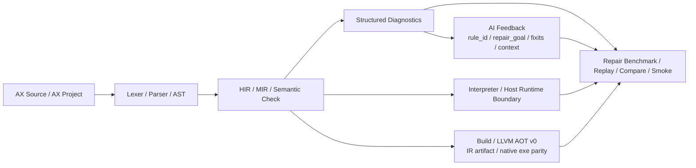

<div align="center">
  

# AX

### 面向 Coding Agent 的 AI-first 语言

[](./LICENSE)
[](./执行路线.md)
[](./docs/repair-benchmark.md)

</div>

AX 是一门面向自回归 Coding AI 的 AI-first 语言，也是一套围绕这门语言持续工程化的编译器、运行时与执行工具链。
它不是只提供一套语法，也不是只把源码跑起来；AX 把显式语法、规范化源码形态、结构化诊断、修复反馈契约、架构上下文协议、解释执行、AOT 编译和 benchmark 证据链并入同一套语言系统，目标是让 agent 生成、修复、理解和演进项目时更稳定。

AX 当前从 CLI 工具、自动化脚本、批处理任务、构建辅助和后端 worker 外围工具切入，并已经形成“解释器稳定执行 + 编译器持续 AOT 化 + 结构化反馈可验证”的工程闭环。
这条路线会在保持 AI-first 约束的前提下，继续扩展标准库、包系统、AOT 后端、后端 worker 能力、配置 / JSON / 日志等服务端基础设施，并成长为一门可以承担后端程序开发的语言。

AX 的长期愿景是：

- 让 Coding AI 更容易生成能通过检查、能运行、能维护的源码
- 让编译器诊断天然变成 agent 可消费的修复协议
- 让项目结构、调用流、宿主边界和验证证据可以被稳定输出给模型
- 让语言从工具程序逐步扩展到后端 worker、服务端组件和可发布程序
- 让标准库、包接口、AOT 后端和部分自举形成完整生态闭环

AX 关注的不只是“模型能不能写出代码”，更关注三件更硬的事：

- 能不能提高首轮生成的一次通过率
- 能不能在出错后提高结构化修复成功率
- 能不能让 agent 在多文件项目里更快理解架构、边界和修改落点

仓库已经具备可运行的 `axc check / run / fmt / build`、结构化 `diagnostics`、`--json --ai` 输出、project-backed 多文件组织、第一阶段 `import/module` 模式、AX 侧共享 foundation、第一批 `std.*` 标准库试点模块，以及 repair benchmark 的导出、评分、对比、smoke 与 CI 资产。

当前 `build` 已经进入 LLVM AOT v0：它稳定导出 source / HIR / MIR / manifest，并能为单文件核心 MIR 子集生成 `generated/main.ll`；通过 `axc build <target> --emit exe` 或兼容环境变量 `AX_LLVM_AOT_LINK=1` 显式开启链接并提供 clang 时，已经可以生成 native executable，并用 parity smoke 对比解释器和 AOT exe 的 `exit code / stdout / stderr`。这不是单纯的 IR 展示，而是 AX 解释器语义和 native 输出开始互相校验的编译器路径。后续会按 `LLVM IR 子集 -> AOT runtime ABI -> 包接口 -> 后端 worker 能力 -> 更完整服务端生态` 的顺序持续扩大覆盖面。

**当前 AOT 快照**：LLVM AOT v0 已经进入“按能力包扩张”的阶段。默认 parity smoke 覆盖 **98 个**样例，其中包含 91 个单文件样例、1 个 `AX.toml` 单入口 project 样例、1 个多文件 project 样例、1 个 `module/import` project 样例、1 个 `std.option/std.result` project 样例、1 个 `std.collections` project 样例、1 个 `std.env` project 样例、1 个本地 path package project 样例，完整执行 `check -> run -> build --json -> native exe`，并逐项比较解释器与 native executable 的退出码、标准输出、标准错误。最新补齐的能力包括 **f32 core v0**、固定数组 / struct / slice equality、显式零长度数组 `[]` lowering、`argv_len()` / `argv_get(...)` native CLI 参数读取、`env_has/env_get` host environment ABI v0、`std.env.try_get` project-backed AOT parity、`string_list_new/push/get/join` 与 `len(string_list)` native runtime ABI v0、`std.collections` 源码级 wrapper AOT parity、mutable slice element assignment、短路 `&& / ||` native 语义、AOT 除零与 `i32` overflow 崩溃防护、AOT runtime error 最小 stderr ABI、project-backed AOT linking 与本地 path package AOT 第一刀、enum 的固定数组 / slice payload equality，以及 `Result.ok(...)` / `Result.err(...)` 这类泛型静态构造器的期望类型推断。AX 的 AOT 路径已经不只是能算数、能控制流、能返回值，而是在持续把结构化数据、文本输出、宿主边界、相等性语义和错误分层一起推向 native 编译闭环。

## 解释器与编译器同步推进

AX 现在有两条执行路径，它们共享同一个 lexer / parser / semantic / HIR / MIR 前端，也都由同一个 `axc` CLI 提供。解释器负责稳定语义落地，编译器负责把同一份 AX 源码逐步编成 native executable；二者不是两套语言，而是同一套语言事实的两种执行形态。

| 路径 | 命令 | 当前定位 | 当前功能 |
| --- | --- | --- | --- |
| 解释器版本 | `axc run <file-or-project>` | 稳定语义执行引擎，也是 AOT 的参考实现 | 支持当前 AX 语言主线：基础类型、函数、控制流、数组 / slice、struct / enum、match、泛型、trait bounds、module/import、project mode、第一批 `std.*` 试点和宿主 builtin |
| 编译器 / AOT 版本 | `axc build <file-or-project>` | 正在快速扩展的 LLVM native 编译路径 | 始终导出 `source.ax`、HIR、MIR、`build-manifest.json`；对单文件 `i32/bool/f32/string/consts/modulo/for/for-in-readonly-slice/runtime-string-slice-for-in/slice-range-read/slice-range-for-in/slice-formatter/slice-equality/break-continue/string-runtime/string-predicate/string-replace/string-split-lines/string-trim/string-pattern/argv/fixed-array-read-write-format/fixed-array-equality/zero-length-array/struct-read-write-format/struct-equality/struct-pattern/enum-unit/payload-enum/payload-enum-equality/enum-complex-payload-formatter/enum-array-slice-payload-equality/expression-match/range-pattern/or-pattern/match-guard/concrete-Result-Option/result-try` 核心子集生成 LLVM IR；`--emit exe` / `--emit all` 且有 clang 时可链接 exe |

一句话理解：**AX 不是“只有解释器”或“另起一个编译器”，而是同一前端、同一语义、解释器和 AOT 编译器同步推进。**
`axc run` 给出稳定执行结果，`axc build` 把当前可编译子集降到 LLVM/native；每新增一包 AOT 能力，都要进入 run vs exe parity 验证。

### build 输出契约

AX 的 `build` 不把 IR 和 exe 对立起来。成熟形态里，**exe 是交付物，IR 是证据，manifest 是合同**：

```text
build/<target>/
  source.ax
  program.hir.json
  program.mir.json
  generated/main.ll
  bin/<target>.exe
  build-manifest.json
```

其中 `bin/<target>.exe` 面向用户运行，`generated/main.ll` 面向后端调试和 AI 取证，HIR/MIR 面向前端与 lowering 验证，`build-manifest.json` 则记录 `requested_emit / user_code_valid / interpreter_supported / aot_supported / backend.status / artifacts / aot_readiness.blockers`，让 CI 和 agent 能判断失败到底属于源码、AOT 子集、runtime ABI、toolchain 还是 linker。

当前 CLI 已经提供显式产物选择：

```powershell
axc build examples/aot_return.ax --emit ir
axc build examples/aot_return.ax --emit exe
axc build examples/aot_return.ax --emit all
axc build examples/aot_return.ax --no-link
```

语义如下：

| 命令 | 含义 |
| --- | --- |
| `axc build <target>` | 当前保持兼容模式：稳定导出 source/HIR/MIR/manifest/LLVM IR；如果设置了 `AX_LLVM_AOT_LINK=1` 则尝试链接 exe |
| `axc build <target> --emit ir` | 只要求 LLVM IR 证据产物，不要求 clang，不把未生成 exe 当成失败 |
| `axc build <target> --no-link` | 等价于 IR-only 构建，用于 CI 快照、后端调试和没有 clang 的机器 |
| `axc build <target> --emit exe` | 明确要求生成 native executable；如果 clang 缺失或链接失败，manifest 会保留 IR 和 blocker，命令以失败码退出 |
| `axc build <target> --emit all` | 明确要求证据产物和 exe 同时生成；当前等价于“保留 IR/HIR/MIR/manifest，并强制链接 exe” |

短期推荐开发和验证时显式使用 `--emit exe`，成熟后 `axc build` 会收口为默认生成 executable，同时继续保留 IR/HIR/MIR/manifest 作为 AX 的可解释构建证据链。

当前 LLVM AOT v0 已支持的 native 子集：

- 单文件 `fn main() -> i32`
- 同文件普通函数调用
- `i32` / `bool` / `f32`
- `let` / assignment / `return`
- top-level `const` v0：支持当前 AOT 类型子集内的 `i32/bool/string` 常量引用
- `if` / `while` / `for` 对应的 MIR `branch` / `goto`
- `break` / `continue`
- 一元 `-` / `!`，其中 `i32` negation overflow 已走 AX runtime error
- `+ - * / %`，其中 `i32` 加减乘 overflow、除零、取余零、`i32::MIN / -1` 和 `i32::MIN % -1` 已走 AX runtime error
- `== != < <= > >=`
- `&& ||`
- `println(i32)` / `println(bool)` / `println(f32)`
- 只读 string literal 直接 `println`，例如 `println("hello")`
- `string` 局部变量 / 参数 / 返回值，当前表示为只读 C 字符串指针
- `string_len(text)` / `len(text)`，当前按 UTF-8 codepoint 数量返回 `i32`
- `string == string` / `string != string` 内容比较，当前通过 C ABI `strcmp` 完成
- `to_string(i32)` / `to_string(bool)` / `to_string(f32)` / `to_string(string)` / `to_string(array)` / `to_string(slice)` / `to_string(struct)` / `to_string(enum)`
- `string_contains(text, needle)` / `string_starts_with(text, prefix)` / `string_ends_with(text, suffix)` 字符串谓词 v0
- `string_replace(text, from, to)` 全量替换 v0，包含 `from == ""` 时按 UTF-8 字符边界插入的解释器一致语义
- `string_split_lines(text)` LF / CRLF 行切分 v0，返回只读 `[string]` slice，可配合 `len(lines)`、`lines[i]` 和 `for in` 遍历
- `string_trim(text)` ASCII whitespace v0，当前通过 AOT runtime helper 分配返回新字符串，按 process-lifetime `malloc` 管理
- `string + string`，当前通过 process-lifetime `malloc` 分配拼接结果，暂不回收
- `argv_len()` / `argv_get(index)` v0：native `main(argc, argv)` 会把 CLI 参数暴露给 AX，参数索引与解释器保持一致，从 `argv_get(0)` 开始读取用户传入的第一个参数
- 固定长度数组 v0：非空 array literal、显式零长度 array literal（例如 `let values: [i32; 0] = []`）、局部变量、函数参数 by value、索引读取、元素写入、`len(array)`、`to_string(array)`、直接 `println(array)` 与 element-wise `==` / `!=`；当前主要验证 `[i32; N]`、`[bool; N]` 和 `[string; N]`
- Slice v0：固定数组可形成 `{ ptr, len }` slice，支持 `values[start:end]` 半开区间、`len(slice)`、`slice[index]` 读取、mutable slice element assignment、`to_string(slice)`、直接 `println(slice)`、同文件 slice 参数调用和 element-wise `==` / `!=`，并让 `for (let value: T in values)` over fixed array 与 `values[start:end]` slice range 直接遍历进入 native parity；`string_split_lines(text)` 返回的 `[string]` slice 也已支持 `len(lines)`、`lines[i]` 与 `for in`；当前 slice range 是 copy-backed slice value，除 `string_split_lines` 外的 host/runtime 返回 slice、跨项目 slice ABI 和完整 ownership/lifetime contract 仍按后续能力包推进
- Struct v0：非泛型 struct 定义、struct literal、局部变量、函数参数 by value、返回值、字段读取、字段写入、字段级 `==` / `!=`、`to_string(struct)` 与直接 `println(struct)`
- Struct Pattern v0：非泛型 struct 的全字段 shorthand 解构 pattern，例如 `Point { x, y }`，可在 `match` 中绑定字段并进入 native lowering；字段别名、partial/nested destructuring 仍走前端诊断或后续能力包
- Unit Enum v0：非泛型无 payload enum、variant 常量、局部变量、函数参数 by value、返回值、`==` / `!=` tag 比较和语句形态 unit enum `match` 判断
- Payload Enum v0：非泛型单 payload variant、unit variant、payload constructor、payload read 和语句形态 payload enum `match` 判断；当前 payload 重点验证 `i32/bool/string` 这类已进入 AOT 的值类型
- Payload Enum Equality v0：payload enum 的 `==` / `!=` 会先比较 tag，再对 `i32/bool/f32/string`、固定数组、struct 和 slice payload 做 native equality；不同 variant 直接按不相等处理，更深层未冻结 layout 的 payload 继续保持 unsupported blocker
- Enum Formatter v0：`to_string(enum)` 与直接 `println(enum)` 已能把 unit variant、`i32/bool/string` payload variant、固定数组 payload、struct payload 和 slice payload 格式化为解释器一致的 `Enum.Variant(...)` 文本，并进入 native parity
- Match Expression v0：表达式形态 `match`、简单 binding pattern、payload binding、block-valued arm 已进入 native lowering，可用于 `return match (...) { ... }` 和 `let x = match (...) { ... }`
- String Pattern v0：`match` 中的 string literal pattern 已通过 native `strcmp` lower，并进入 executable parity
- Range Pattern v0：`i32` inclusive range pattern，例如 `200..=299`，已 lower 成 native 比较并进入 executable parity
- Or Pattern v0：无绑定 alternative 的 `A | B` pattern 已 lower 成 native boolean 合并；当前重点验证 unit enum variant 组合
- Match Guard v0：guarded arm 的 bool guard 已进入 native branch lowering；pattern binding / payload binding 会先绑定再计算 guard，guard 为 false 时继续尝试后续 arm
- Concrete Generic Enum Instance v0：同文件非泛型函数内的 `Option<i32>` 与 `Result<i32,string>` 可以以具体实例进入 native layout，支持构造、传参、返回、`match` 读取、`to_string(...)` 和直接 `println(...)`；这不是完整泛型函数 / impl / std project linking 的 monomorphization 承诺
- Result / Try v0：`Result<T,E>` 形状的 `expr?` 可以在 AOT 中生成 Ok 解包与 Err early return；`Result.ok(...)` / `Result.err(...)` 这类泛型静态构造器可以从 `let` / `return` / `match` 上下文推断缺失类型参数；当前重点验证同文件具体 `Result<i32,string>` / `Result<string,string>` 实例和 string 错误类型

当前 AOT parity smoke 默认覆盖 98 个样例，完整清单由 [`scripts/smoke-aot-parity.ps1`](./scripts/smoke-aot-parity.ps1) 维护。这组样例会依次跑 `check -> run -> build --json -> native exe`，并比较解释器和 exe 的退出码、标准输出、标准错误；新增收口样例包括 [`examples/project_hello/`](./examples/project_hello/)、[`examples/project_split/`](./examples/project_split/)、[`examples/project_module_smoke/`](./examples/project_module_smoke/)、[`examples/project_option_result/`](./examples/project_option_result/)、[`examples/project_collections_core/`](./examples/project_collections_core/)、[`examples/project_env_result/`](./examples/project_env_result/)、[`examples/project_package_math/`](./examples/project_package_math/)、[`examples/string_list.ax`](./examples/string_list.ax)、[`examples/slice_assignment.ax`](./examples/slice_assignment.ax)、[`examples/empty_array.ax`](./examples/empty_array.ax)、[`examples/aot_argv.ax`](./examples/aot_argv.ax)、[`examples/result_static_constructors.ax`](./examples/result_static_constructors.ax)、[`examples/result_propagation.ax`](./examples/result_propagation.ax)、[`examples/aot_f32_core.ax`](./examples/aot_f32_core.ax)、[`examples/aot_array_equality.ax`](./examples/aot_array_equality.ax)、[`examples/aot_struct_equality.ax`](./examples/aot_struct_equality.ax)、[`examples/aot_slice_equality.ax`](./examples/aot_slice_equality.ax)、[`examples/aot_enum_array_payload_equality.ax`](./examples/aot_enum_array_payload_equality.ax) 和 [`examples/aot_enum_slice_payload_equality.ax`](./examples/aot_enum_slice_payload_equality.ax)。

AOT 的能力边界也会被结构化管理：`to_string(string_list)` 或尚未具备 native formatter / native layout 的值、除 `string_split_lines` 外的 host/runtime slice 来源、跨项目 slice ABI、完整 slice ownership/lifetime、partial / nested struct destructuring、带绑定的 or pattern、跨项目 methods / impl / traits / generics native linking、更完整 `std`/native package linking、更完整本地包 native linking 和完整 host runtime ABI 会继续按能力包推进。当前不在 AOT 子集里的能力会进入 `aot_readiness.blockers` 或 LLVM lowering blocker，不会被伪装成用户源码错误，也不会让 AI 误改合法业务代码。

### AOT 当前水位与下一步

以当前 `G3 Core AOT Parity` 目标衡量，AX AOT 已经完成第一批核心 native 能力的大半段：基础值类型、`f32` core、函数调用、top-level `const`、控制流、循环、`for`、`for in` over fixed array/slice range/runtime string slice、`break`、`continue`、stdout、string v0、string runtime v0、string predicate v0、string replace v0、string split-lines v0、string trim v0、string_list runtime v0、string literal pattern、CLI 参数读取 `argv_len/argv_get` v0、固定数组 read/write/formatter/equality、显式零长度数组 literal、slice read/write/range/param/for-in/runtime iteration/formatter/equality v0、struct read/write/formatter/equality、struct pattern、unit enum、payload enum v0、payload-aware equality、enum formatter/print v0、enum 固定数组/struct/slice payload formatter、enum 固定数组/slice payload equality、语句形态 enum `match`、表达式形态 `match`、`i32` range pattern、无绑定 or pattern、guarded match arm、具体 `Option<i32>` / `Result<i32,string>` enum 实例、concrete generic enum formatter/print、`Result.ok(...)` / `Result.err(...)` 静态构造器，以及 `Result` 的 `?` early return 都已经进入 run vs executable parity。更直白地说，AOT 已经从“能不能做”的证明阶段，进入了“按能力包快速扩张”的阶段。

现在最关键的下一组能力不是再补几个零散运算符，而是把 AX 的结构化数据和错误模型继续向真实项目推进。短期 AOT 收口顺序是：

1. 更完整的 payload enum contract：继续补更深层组合 payload formatter、更深层组合 payload equality 和更完整 enum runtime contract。
2. 复杂 pattern lowering：带绑定的 or pattern、partial / nested struct destructuring 继续按能力包进入 AOT。
3. slice layout 与更完整 runtime ABI：让集合、字符串和宿主边界继续靠近真实工具程序。
4. std/native package linking 和 local path package AOT：在已打通 module/import、std.option/std.result 与纯函数 local path package AOT 后，继续收口更完整的标准库 monomorphization 和本地包 native linking。

这条顺序服务的是 AX 的核心思想：**同一份源码，解释器能跑，AOT 能编；失败时能分清是用户源码错误、AOT 子集缺口、toolchain 问题，还是编译器内部问题。** 这样 AI 才能知道什么时候应该改源码，什么时候应该解释后端限制，什么时候应该提示安装或配置工具链。

## 项目导航

| 你想知道什么                | 该看哪里                                                           |
| --------------------------- | ------------------------------------------------------------------ |
| 项目是什么、为什么值得关注  | [`README.md`](./README.md)                                         |
| AI-first 具体先落在哪些场景 | [`docs/application-scenarios.md`](./docs/application-scenarios.md) |
| 当前已经做到哪了            | [`PROJECT_FACTS.md`](./PROJECT_FACTS.md)                           |
| 当前 benchmark 证据链       | [`docs/benchmark-showcase.md`](./docs/benchmark-showcase.md)       |
| Repair Workbench 前端       | [`web/`](./web/)                                                    |
| 下一轮修复证据展示层        | [`docs/repair-archaeology.md`](./docs/repair-archaeology.md)       |
| 对外怎么准确介绍            | [`docs/public-claims.md`](./docs/public-claims.md)                 |
| 本机和 CI 应该跑什么        | [`docs/validation-matrix.md`](./docs/validation-matrix.md)         |
| 外部 JSON / artifact 契约   | [`docs/interface-contracts.md`](./docs/interface-contracts.md)     |
| LLVM AOT v0 后端边界        | [`docs/llvm-aot.md`](./docs/llvm-aot.md)                           |
| 语言能力当前支持状态        | [`docs/language-support-status.md`](./docs/language-support-status.md) |
| 全项目按什么阶段推进        | [`执行路线.md`](./执行路线.md)                                     |
| 曾经的计划与旧施工单        | [`曾经的计划/`](./曾经的计划/)                                     |
| 哪些事情已经做完            | [`ARCHIVE.md`](./ARCHIVE.md)                                       |

## Web 与社区门户

AX 已经开始把 `web/` 从单一前端 demo 升级成语言项目的对外门户。
它不是编译器主线的一部分，而是 AX 对外展示、社区入口和 AI-readable docs 的承载层。

当前 `web/` 包含：

- 官网首页：用更直观的方式说明 AX 是什么、适合什么场景、为什么围绕 Coding AI 设计
- Docs 入口：把 quickstart、语言指南、AI 协议、编译器内部结构和验证矩阵组织成清晰入口
- Packages catalog v0：先展示官方 `std.*` 试点模块和代表性 project-backed 样例，后续包系统成熟后再升级成真正 registry
- Benchmarks 展示：把 repair benchmark、smoke、deterministic replay 和 Repair Archaeology 作为对外证据入口
- Repair Workbench：展示同一个坏例子在 cold / base / ai 三档反馈下的差异
- Context 展示：说明 `overview / boundaries / topology / flow / symbol / impact / evidence` 这套架构上下文协议
- Download / platform 入口：把 Windows、Linux、macOS 的支持层级讲清楚
- AI-readable docs：`/llms.txt` 与 `/llms-full.txt`，方便搜索引擎和 Coding AI 正确理解 AX

当前公网预览：

```text
http://101.37.238.42
```

域名 `ax-language.top` 已经解析到当前服务器，但因为服务器在中国内地 ECS 上，正式域名访问需要等待 ICP 备案放行。
备案完成前，公网 IP 预览可用于页面调试、社区文案迭代和截图展示。

这一层的目标不是提前伪装成成熟生态，而是先让外部用户、贡献者和 AI 搜索都能看到 AX 的完整形态：

- AX 是一门语言
- AX 有文档入口
- AX 有标准库和包目录的雏形
- AX 有 benchmark 与 repair 证据链
- AX 有 agent 可消费的上下文协议
- AX 正在从工具语言走向后端可用语言

当前仓库的主推进区间仍然是 `P0-P3`，其中 `P2` 是语言内核主增长线，`P1` 是编译器护城河硬化线：

- `P0` 继续收紧环境与外部契约
- `P1` 继续做硬 repair/context/benchmark 证据链
- `P2` 继续拓展语言内核与代表样例，避免过早把 AX 锁死在“只写小工具”的范围内
- `P3` 已进入第一批 `std.*` 标准库试点阶段，但尚未全仓冻结

完整的阶段门槛和前置条件看 [`执行路线.md`](./执行路线.md)。

## 一眼看懂 AX

| 项目维度     | AX 当前提供什么                                                                                       |
| ------------ | ----------------------------------------------------------------------------------------------------- |
| 项目定位     | `AI-first Tool Language -> Backend-capable Language`                                                  |
| 核心问题     | 什么样的语言表面、诊断结构、上下文协议和修复反馈，最适合自回归模型稳定生成、稳定修复和稳定理解项目    |
| 关键收益     | 提高一次通过率、提高修复成功率、提高多文件项目中的架构理解效率，并把这些能力带入真实后端开发          |
| 当前主要场景 | agent 生成 CLI 工具、可修复自动化脚本、后端 worker 辅助、compiler-guided repair benchmark             |
| 演进方向     | 标准库、包系统、AOT 后端、后端 worker、服务端基础设施、部分自举                                       |
| 当前形态     | 语言前端 + 稳定解释执行 + LLVM AOT v0 native 编译路径 + project mode + structured diagnostics + context + repair benchmark + Repair Workbench 前端 + 标准库试点 |
| 核心价值     | 把语言本体、编译器反馈、AI 消费链路和未来后端生态放进同一个可运行仓库                                 |

## AX 的核心优势

| 优势                                | 具体体现                                                                                                                             | 对真实使用的意义                                             |
| ----------------------------------- | ------------------------------------------------------------------------------------------------------------------------------------ | ------------------------------------------------------------ |
| 同时拥有源码、诊断、修复、benchmark | AX 同时定义语法、结构化诊断、AI 反馈字段、repair case 和 compare 链路                                                                | 设计价值可以直接通过工程链路验证                             |
| 对自回归模型原生友好                | 显式类型、较少等价写法、较少隐式规则、`fmt` 驱动的规范化输出                                                                         | 更容易提高首轮生成的一次通过率                               |
| 编译器反馈可直接给 Agent 消费       | `rule_id`、`repair_goal`、`fixits`、`context_snippets` 等字段已经进入输出层                                                          | 错误反馈可直接进入自动化修复链                               |
| 架构上下文可直接给 Agent 消费       | `overview / topology / boundaries / flow / symbol / impact / evidence` 七个稳定视图承载同一套六层语义协议                            | 多文件项目里的结构理解、边界识别和修改落点判断更稳定         |
| 解释器与编译器共享同一前端          | `axc run` 和 `axc build` 都建立在同一套 lexer / parser / semantic / HIR / MIR 之上，AOT 以解释器语义为参考做 native parity             | 语言不会分裂成两套实现，新增语法可以同时进入检查、解释执行和编译验证 |
| 修复链不是口头承诺，而是协议闭环    | diagnostics、上下文协议、repair contract、benchmark 共用同一条输入输出链；`-IncludeContext` 已能把 context bundle 导入 repair export | 修复成功率、回归率和上下文价值都可以被实际测量               |
| 真工具样例已经进入仓库主线          | 仓库里已经有 workspace audit、release snapshot、search report、directory index 等样例                                                | 可以直接观察 AX 在真实工具型任务上的表达能力                 |
| 多文件工程组织开始成型              | `AX.toml + sources` 已经稳定，第一阶段 `import/module` 已接入主线                                                                    | foundation 代码与项目私有逻辑开始拥有清晰边界                |
| benchmark 证据链是一等公民          | repair cases、adapter spec、export、score、compare、smoke、CI 都在仓库里                                                             | 项目价值可以靠数据、回放和对比来建立                         |
| 修复证据将进入可解释展示层          | `Repair Archaeology v0` 已作为下一轮增长点登记，目标是把 replay / score / compare 变成 case 级 JSON 与 Markdown 修复故事             | 外部读者可以按 case 理解“怎么修、哪里失败、context 是否参与” |

当前仓库内可复现 benchmark 快照见 [`docs/benchmark-showcase.md`](./docs/benchmark-showcase.md)：已发布的 deterministic replay 快照覆盖 `30` 个 repair case，当前 full manifest 已继续扩展到 `43` 个 case，smoke subset 固定为 `13` 个 case，并加入 `Result` 错误传播 `?`、包解析和结构化 pattern 相关误用诊断。这个结果证明的是 AX 内部修复证据链已经成立；跨语言、跨模型 live benchmark 仍是下一阶段公开证明。

对外引用 AX 时，建议同时遵守 [`docs/public-claims.md`](./docs/public-claims.md)：仓库内可复现事实可以直接说，跨语言、跨模型和 live-model 收益必须作为后续验证目标来表述。

## AX 的真实优势与应用场景

AX 的价值首先在于它作为语言本体和工具链，能否更稳地承载 AI 写工具；同时它又把 diagnostics、context、repair 和 benchmark 做成了编译器的一部分。

### 1. 更高的一次通过率

AX 追求的是让模型在第一轮就更接近可通过代码，而不是先生成一坨“看起来像对的代码”再慢慢试错。

这来自几件事同时成立：

- 源码表面形式更稳定
- 等价写法更少
- 隐式规则更少
- 类型和结构边界更显式
- `fmt` 让输出更容易收敛到统一形态

### 2. 更高的修复成功率

AX 不把报错只当成“给人看的提示”，而是直接把 diagnostics 设计成可被 agent 消费的修复协议入口。

编译器反馈里已经把下面这些信息纳入主链：

- `code`
- `rule_id`
- `repair_goal`
- `fixits`
- `context_snippets`

这意味着模型不是只看到一句“哪里错了”，而是能直接拿到结构化修复目标。

### 3. 更强的项目架构理解

多文件项目里，模型常见问题不是“完全读不懂代码”，而是：

- 不知道入口在哪
- 不知道该改哪层
- 不知道哪些文件触碰宿主边界
- 不知道改一个 symbol 会不会把别的地方带崩

AX 把这些问题收进六层协议上下文里，让项目结构、主流程、宿主边界、局部修改切片和验证证据都能变成稳定输出。

### 4. 更适合 agent 闭环工作的真实场景

AX 的应用场景，不是抽象地说“AI 会写代码”，而是先落在几类能被快速验证的真实任务里：

| 场景                              | AX 解决什么                                                          | 当前对应资产                                                                    |
| --------------------------------- | -------------------------------------------------------------------- | ------------------------------------------------------------------------------- |
| Agent-generated CLI tools         | 让 agent 生成的小工具能立刻检查、运行、格式化和回归                  | `examples/project_text_normalize/`、`examples/project_directory_index/`、`std/` |
| Repairable automation scripts     | 让自动化脚本的错误进入结构化诊断、修复目标和可回放候选链             | `src/ai.rs`、`benchmarks/`、`docs/repair-benchmark.md`                          |
| Backend worker utilities          | 先承载发布辅助、批处理、报告生成、文件整理、构建辅助这类后端外围工具 | `examples/project_release_promote/`、`examples/project_command_batch/`          |
| Compiler-guided repair benchmarks | 把错误、修复候选、评分、对比和 context 输入做成可验证证据            | `docs/benchmark-showcase.md`、`docs/repair-archaeology.md`                      |

更完整的场景边界见 [`docs/application-scenarios.md`](./docs/application-scenarios.md)。
AX 往后端语言方向走的顺序也固定为：先 CLI / worker tools 与本地 path package v0，再推进 AOT、JSON / config / log、backend workers，最后才评估 HTTP client/server、async 和网络生态。

## AX 的工作原理



AX 把一段源码送入编译器后，会同步产出三层结果：

1. 语言前端结果  
   `Lexer -> Parser -> AST -> HIR -> MIR -> Semantic Check`

2. 结构化诊断结果  
   统一的 `Diagnostic` schema，支持文本、JSON 和 AI 增强字段

3. 可回放证据结果  
   repair benchmark、adapter 输出、评分结果、compare 报告、smoke 回归

`axc run` 走解释器，是稳定执行路径；`axc build` 走构建 / AOT 路径，始终输出稳定构建产物，并在当前 LLVM AOT v0 子集内生成 IR 或 native exe。AOT 的正确性不靠口头承诺，而是通过 run vs exe parity smoke 和 snapshot 测试持续验证。

AX 把“源码如何被模型消费、错误如何被模型修复、修复结果如何被验证”一起工程化。
这也是 AX 和一般实验语言项目最有区分度的地方。

## AX 的六层协议上下文

AX 不只输出编译结果和修复反馈，也输出一套专门给 agent 消费的架构上下文协议。

这套协议的目标不是“再写一份项目说明书”，而是把项目结构、宿主边界、主流程、局部修改切片和验证证据压缩成稳定 JSON，让模型在真正改代码之前先拿到一份可执行上下文。

### 六层协议，一套视图

| 协议层     | 视图 / 命令       | 解决什么问题                               | 对 agent 的意义              |
| ---------- | ----------------- | ------------------------------------------ | ---------------------------- |
| 总览层     | `overview`        | 这个项目是什么，入口在哪，规模多大         | 3 秒定向，不再全仓乱读       |
| 结构层     | `topology`        | 模块、导入、导出、基础 symbol 关系是什么   | 快速知道该改哪一层           |
| 边界层     | `boundaries`      | 哪些文件触碰了 `fs / process / env / argv` | 给模型一个真实安全网         |
| 流程层     | `flow`            | 主流程从哪里进入，经过哪些关键调用         | 帮模型沿流程追问题           |
| 任务切片层 | `symbol / impact` | 围绕当前目标符号的一圈上下文与影响面       | 减少无关上下文，控制改动半径 |
| 证据层     | `evidence`        | 改完要看哪些 tests / examples / benchmarks | 让修复进入验证闭环           |

### 统一协议壳层

AX 的上下文协议和 diagnostics 一样，不靠长段自然语言堆信息，而是使用稳定壳层：

```json
{
  "schema_version": 1,
  "view": "boundaries",
  "subject": {
    "kind": "project",
    "path": "examples/project_workspace_search_report"
  },
  "facts": {},
  "hints": {},
  "validation": {}
}
```

三段式含义固定：

- `facts`
  编译器能稳定确认的事实
- `hints`
  带依据的弱提示，不伪装成事实
- `validation`
  建议的验证命令、检查路径和预期产物

### 协议视图总览

```powershell
axc context overview <path> --json
axc context topology <path> --json
axc context boundaries <path> --json
axc context flow <path> --json
axc context symbol <path> <symbol> --json
axc context impact <path> <symbol> --json
axc context evidence <path> <symbol> --json
```

### `overview`：先给模型一个稳定锚点

```powershell
axc context overview examples/project_module_smoke --json
```

预期返回：

```json
{
  "schema_version": 1,
  "view": "overview",
  "subject": {
    "kind": "project",
    "path": "examples/project_module_smoke"
  },
  "facts": {
    "project_name": "project_module_smoke",
    "entry": "src/main.ax",
    "module_mode": true,
    "source_roots": ["lib"],
    "summary": {
      "source_unit_count": 2,
      "module_count": 1,
      "function_count": 2,
      "type_count": 1
    }
  },
  "hints": {
    "entrypoints": ["main"],
    "core_symbols": ["main", "lib.report.build_summary", "lib.report.Summary"]
  },
  "validation": {
    "recommended_commands": [
      "axc check examples/project_module_smoke",
      "axc run examples/project_module_smoke"
    ]
  }
}
```

这一层的价值很直接：

- 不让 agent 一上来读整个仓库
- 先知道入口和项目规模
- 先知道哪几个 symbol 最值得关注

### `topology`：把模块关系压成稳定结构图

```powershell
axc context topology examples/project_module_smoke --json
```

预期返回：

```json
{
  "schema_version": 1,
  "view": "topology",
  "subject": {
    "kind": "project",
    "path": "examples/project_module_smoke"
  },
  "facts": {
    "modules": [
      {
        "unit": "src/main.ax",
        "module_path": null,
        "is_entry": true,
        "imports": ["lib.report"],
        "exports": ["main"]
      },
      {
        "unit": "lib/report.ax",
        "module_path": "lib.report",
        "is_entry": false,
        "imports": [],
        "exports": ["lib.report.Summary", "lib.report.build_summary"]
      }
    ],
    "module_edges": [
      {
        "from": "src/main.ax",
        "to": "lib.report",
        "kind": "import"
      }
    ],
    "symbol_edges": [
      {
        "from": "main",
        "to": "lib.report.build_summary",
        "kind": "call"
      },
      {
        "from": "main",
        "to": "lib.report.Summary",
        "kind": "type_ref"
      }
    ]
  },
  "hints": {
    "role_hints": [
      {
        "unit": "src/main.ax",
        "roles": ["entry_orchestrator"],
        "evidence": ["declares_main", "imports_support_module"]
      },
      {
        "unit": "lib/report.ax",
        "roles": ["project_library"],
        "evidence": ["declares_exported_type", "declares_exported_function"]
      }
    ]
  },
  "validation": {}
}
```

这层解决的是：

- 该去哪一个 unit 改
- 当前模块和 support module 怎么连
- 哪些 symbol 是入口层，哪些 symbol 是库层

### `boundaries`：给 agent 一个真正的安全网

```powershell
axc context boundaries examples/project_workspace_search_report --json
```

预期返回：

```json
{
  "schema_version": 1,
  "view": "boundaries",
  "subject": {
    "kind": "project",
    "path": "examples/project_workspace_search_report"
  },
  "facts": {
    "host_boundary_classes": ["argv", "filesystem"],
    "unit_boundary_usage": [
      {
        "unit": "src/main.ax",
        "argv_builtins": ["argv_len", "argv_get"],
        "fs_builtins": ["fs_read_dir", "fs_write_string"],
        "process_builtins": [],
        "env_builtins": []
      },
      {
        "unit": "lib/file_search.ax",
        "argv_builtins": [],
        "fs_builtins": [
          "fs_is_file",
          "fs_is_dir",
          "fs_read_dir",
          "fs_read_to_string",
          "fs_file_size"
        ],
        "process_builtins": [],
        "env_builtins": []
      },
      {
        "unit": "lib/report.ax",
        "argv_builtins": [],
        "fs_builtins": [],
        "process_builtins": [],
        "env_builtins": []
      }
    ]
  },
  "hints": {
    "host_heavy_units": [
      {
        "unit": "lib/file_search.ax",
        "reason": "recursive_filesystem_calls"
      },
      {
        "unit": "src/main.ax",
        "reason": "entry_argument_and_output_boundary"
      }
    ],
    "safe_logic_units": ["lib/report.ax", "lib/search_totals.ax"],
    "constraint_candidates": [
      {
        "kind": "keep_host_free",
        "target": "lib/report.ax",
        "evidence": ["host_builtin_count=0", "used_as_shared_logic=true"]
      },
      {
        "kind": "entry_only_write",
        "target": "src/main.ax",
        "evidence": [
          "fs_write_string_seen_in_entry=true",
          "non_entry_write_count=0"
        ]
      }
    ]
  },
  "validation": {
    "invariants": [
      "filesystem writes stay concentrated in entry orchestration",
      "pure report formatting remains host-free"
    ]
  }
}
```

这层是 AX 特别重要的一层，因为它直接回答：

- 哪些地方危险
- 哪些模块是 pure logic
- 哪些 unit 已经深入宿主边界
- 哪些低风险约束可以直接作为 agent 的候选护栏

### `flow`：让模型沿主流程追代码

```powershell
axc context flow examples/project_workspace_search_report --json
```

预期返回：

```json
{
  "schema_version": 1,
  "view": "flow",
  "subject": {
    "kind": "project",
    "path": "examples/project_workspace_search_report"
  },
  "facts": {
    "entry_symbol": "main",
    "entry_unit": "src/main.ax",
    "entry_flow": [
      "main",
      "require_min_args",
      "require_directory",
      "search_path",
      "build_summary",
      "render_match_lines",
      "fs_write_string"
    ],
    "branch_points": [
      "argument_and_directory_validation",
      "file_or_directory_dispatch"
    ],
    "recursive_symbols": ["search_path"]
  },
  "hints": {
    "primary_workload": "recursive_workspace_search_and_report_write"
  },
  "validation": {}
}
```

这一层把“代码树”变成“流程图”，让模型知道：

- 主流程从哪里进
- 哪些函数是真正编排点
- 哪些位置是递归和分支热点

### `symbol`：围绕当前改动目标输出局部切片

```powershell
axc context symbol examples/project_module_smoke lib.report.build_summary --json
```

预期返回：

```json
{
  "schema_version": 1,
  "view": "symbol",
  "subject": {
    "kind": "symbol",
    "path": "examples/project_module_smoke",
    "symbol": "lib.report.build_summary"
  },
  "facts": {
    "symbol_kind": "function",
    "declared_in": "lib/report.ax",
    "module_path": "lib.report",
    "signature": {
      "params": [],
      "returns": "lib.report.Summary"
    },
    "depends_on_types": ["lib.report.Summary"],
    "direct_callers": ["main"],
    "direct_callees": [],
    "host_capabilities": []
  },
  "hints": {
    "edit_scope": "local",
    "change_risk": "low",
    "coupled_symbols": ["lib.report.Summary", "main"]
  },
  "validation": {
    "recommended_commands": [
      "axc check examples/project_module_smoke",
      "axc run examples/project_module_smoke"
    ]
  }
}
```

这层是 AX 给 agent 的“局部手术刀”：

- 不用把整个项目重新读一遍
- 直接围绕当前目标 symbol 提供最相关的一圈上下文
- 让修改范围和风险控制更可预期

### `impact`：修改前先看会波及谁

```powershell
axc context impact examples/project_workspace_search_report search_path --json
```

预期返回：

```json
{
  "schema_version": 1,
  "view": "impact",
  "subject": {
    "kind": "symbol",
    "path": "examples/project_workspace_search_report",
    "symbol": "search_path"
  },
  "facts": {
    "declared_in": "lib/file_search.ax",
    "direct_callers": ["main", "search_path"],
    "direct_callees": [
      "fs_is_file",
      "is_searchable_file",
      "search_file",
      "fs_is_dir",
      "fs_read_dir"
    ],
    "affected_units": [
      "src/main.ax",
      "lib/file_search.ax",
      "lib/search_totals.ax"
    ]
  },
  "hints": {
    "change_risk": "medium_high",
    "risk_reasons": ["entry_reachable", "recursive_symbol", "host_boundary"]
  },
  "validation": {
    "invariants": [
      "search_path must keep recursive traversal semantics",
      "search_path must still return FileSearch"
    ]
  }
}
```

这层回答的是：

- 改一个 symbol 会炸到谁
- 哪些 caller / callee / unit 会被带上
- 这次修改大概属于低风险还是高风险

### `evidence`：把上下文接进验证闭环

```powershell
axc context evidence examples/project_workspace_search_report search_path --json
```

预期返回：

```json
{
  "schema_version": 1,
  "view": "evidence",
  "subject": {
    "kind": "symbol",
    "path": "examples/project_workspace_search_report",
    "symbol": "search_path"
  },
  "facts": {
    "related_units": [
      "src/main.ax",
      "lib/file_search.ax",
      "lib/report.ax",
      "lib/search_totals.ax"
    ],
    "related_examples": [
      "examples/workspace_search_report.ax",
      "examples/project_directory_index"
    ],
    "related_docs": ["docs/host-runtime-boundary.md", "架构上下文文档.md"],
    "related_benchmarks": ["repair-benchmark", "compare-repair-modes"]
  },
  "hints": {
    "best_reading_order": [
      "src/main.ax",
      "lib/file_search.ax",
      "lib/search_totals.ax",
      "lib/report.ax"
    ]
  },
  "validation": {
    "recommended_commands": [
      "axc check examples/project_workspace_search_report",
      "axc run examples/project_workspace_search_report -- <root_dir> <needle> <output>"
    ],
    "expected_artifacts": [
      "output report file",
      "summary with root / needle / matched_lines"
    ]
  }
}
```

这一层的意义不是“再讲一遍项目背景”，而是：

- 直接告诉 agent 该用什么验证命令
- 当前改动最相关的 example / test / benchmark 是什么
- 让“改代码”进入“可证明改对了”的闭环

### 这套协议真正带来的变化

AX 的六层协议上下文，不只是让模型“更快读懂项目”，更重要的是让上下文从静态文档变成一组可执行视图：

- `overview`
  负责定向
- `topology`
  负责结构导航
- `boundaries`
  负责安全网
- `flow`
  负责主流程跟踪
- `symbol / impact`
  负责局部改动切片与影响面
- `evidence`
  负责验证闭环

这也是 AX 和普通“编译器能吐 AST / HIR / MIR JSON”的项目很不一样的地方：

- AX 不只输出编译结果
- AX 还输出专门给 agent 消费的项目上下文协议
- diagnostics、repair contract、context protocol、benchmark evidence 共用同一条工程主线

## AX 现在已经具备的成熟度

| 方面             | 当前状态                                                                                                                                                                                                  | 仓库位置                                                                                                               |
| ---------------- | --------------------------------------------------------------------------------------------------------------------------------------------------------------------------------------------------------- | ---------------------------------------------------------------------------------------------------------------------- |
| 编译器前端       | 已打通 `Lexer -> Parser -> AST -> HIR -> MIR -> Semantic Check` 主链                                                                                                                                      | [`src/`](./src/)                                                                                                       |
| 执行能力         | 已支持解释执行，能够运行真实 tool-style examples，并作为 AOT native parity 的语义参考                                                                                                                     | [`src/interpreter.rs`](./src/interpreter.rs)                                                                           |
| AOT 编译         | LLVM AOT v0 已能为 98 个 core/control-flow/consts/f32-core/for-in-slice/runtime-string-slice-for-in/slice-range-read-write/slice-formatter-equality/stdout/string/string-runtime/string-predicate/string-replace/string-split-lines/string-trim/string-list-runtime/std-collections/std-env/string-pattern/argv/array-read-write-format-equality/zero-length-array/struct-read-write-format-equality/struct-pattern/enum-unit/payload-enum/payload-enum-equality/enum-formatter/enum-print/enum-complex-payload-formatter/enum-array-slice-payload-equality/concrete-generic-enum-print/expression-match/range-pattern/or-pattern/match-guard/concrete-Result-Option/result-static-constructors/result-try/project-backed 样例生成 IR、链接 native exe，并与解释器比较 `exit code / stdout / stderr`          | [`src/backend/llvm/`](./src/backend/llvm/) [`docs/llvm-aot.md`](./docs/llvm-aot.md)                                  |
| 诊断输出         | 已支持文本诊断、`--json`、`--json --ai` 三层输出                                                                                                                                                          | [`docs/diagnostics-schema.md`](./docs/diagnostics-schema.md)                                                           |
| AI 修复反馈      | 已沉淀 `rule_id / repair_goal / fixits / context_snippets`                                                                                                                                                | [`src/ai.rs`](./src/ai.rs)                                                                                             |
| 项目组织         | 已支持 `AX.toml + sources` 的 project-backed 多文件项目，并启动 `[dependencies] alias = { path = ... }` 本地 AX 包接口 v0                                                                                 | [`src/project.rs`](./src/project.rs)                                                                                   |
| 模块模式         | 第一阶段 `import/module` 已接入 parser、project、semantic check，并有 smoke 项目验证                                                                                                                      | [`examples/project_module_smoke/`](./examples/project_module_smoke/)                                                   |
| AX 侧共享库      | 已沉淀 `foundation/cli / report / text / search / file_kind / workspace`，并启动 `std.cli / std.env / std.fs / std.option / std.path / std.process / std.report / std.result / std.text / std.workspace` 试点；Std-1 冻结候选已收口 | [`foundation/`](./foundation/) [`std/`](./std/) [`docs/stdlib-minimal-boundary.md`](./docs/stdlib-minimal-boundary.md) |
| 构建产物         | `build` 已稳定导出 `source.ax`、HIR、MIR、manifest、project-sources 快照                                                                                                                                  | [`src/build.rs`](./src/build.rs)                                                                                       |
| benchmark 证据链 | repair cases、adapter、export、score、compare、smoke、CI 均已进入仓库主线                                                                                                                                 | [`docs/repair-benchmark.md`](./docs/repair-benchmark.md)                                                               |
| 平台支持         | Windows 工作流最完整；Linux 已打通核心 compiler/runtime 命令                                                                                                                                              | [`docs/platform-support.md`](./docs/platform-support.md)                                                               |

## 我们现在在做什么

当前主线聚焦把下面几件事做硬：

| 当前主线                                        | 目的                                                                                                                                                                                                                                                                 | 结果会体现在哪里                                                                                                                                                                                                       |
| ----------------------------------------------- | -------------------------------------------------------------------------------------------------------------------------------------------------------------------------------------------------------------------------------------------------------------------- | ---------------------------------------------------------------------------------------------------------------------------------------------------------------------------------------------------------------------- |
| 推进语言内核与可写项目能力                      | 继续补最值钱的表达能力、宿主能力和 project-backed 工程组织；短期服务工具/自动化场景，中期面向后端语言能力扩展                                                                                                                                                       | `foundation/`、`examples/project_*`、`SYNTAX.md`                                                                                                                                                                       |
| 推进显式、确定的模块组织                        | 让 shared foundation 和 project-private logic 有清晰边界                                                                                                                                                                                                             | `AX.toml + sources`、`module`、`import`、全限定名                                                                                                                                                                      |
| 推进本地 AX 包接口                              | 先让项目可以复用本地 AX 源码包，用户导入的是 AX package/module，而不是 Rust crate 直通桥                                                                                                                                                                             | `AX.toml [dependencies]`、`examples/project_package_config/`、`tests/interface_snapshots.rs`                                                                                                                           |
| 为第一版最小标准库做冻结试点                    | 用 `project_text_normalize`、`project_directory_index`、`project_release_promote`、`project_command_capture`、`project_command_batch` 验证 `std.*` 命名空间、全限定调用、递归工具逻辑、发布型文件操作、命令捕获、命令执行、环境变量检查和项目私有 `lib.*` 的组合成本 | `std/`、`examples/project_text_normalize/`、`examples/project_directory_index/`、`examples/project_release_promote/`、`examples/project_command_capture/`、`examples/project_command_batch/`、`执行路线.md` |
| 做硬 diagnostics / context / repair / benchmark | 让语言主线自带可消费的编译器反馈和可回放证据链                                                                                                                                                                                                                       | `src/ai.rs`、`benchmarks/`、`scripts/`、`docs/benchmark-showcase.md`                                                                                                                                                   |
| 用代表性样例反向驱动语言设计                    | 每补一项能力，都要求它能支撑一个更真实的工具样例                                                                                                                                                                                                                     | `examples/`、`tests/interface_snapshots.rs`                                                                                                                                                                            |
| 推进 AOT + 错误分层 + parity 验证               | 让 `axc build` 的每个失败都能被归类，并让 native exe 与解释器语义对齐；不支持的能力进入 blocker，不让 AI 误改用户源码                                                                                                                                             | `src/backend/llvm/`、`src/build/`、`scripts/smoke-aot-parity.ps1`、`docs/llvm-aot.md`                                                                                                                                    |

这条主线的判断标准很直接：
新能力需要同时提升可写性、可测性、可修复性，才能进入更高优先级；其中可写性和工程组织能力优先决定语言主线是否继续前进。

把这几条线压成项目阶段语言，就是：

- 先做硬 `P0` 的契约地基
- 再以 `P2` 继续推进语言内核与可写项目能力，不把当前阶段误读成“工具语言已经完成”
- 同步推进 `P1` 的编译器护城河闭环
- 继续推进 `P3` 的官方最小标准库试点与冻结
- 本地 path package v0 与 `AX.lock` v0 已启动；AOT、registry、自举和生态扩张继续按 [`执行路线.md`](./执行路线.md) 的后续阶段推进

## 快速理解 AX 现在能做什么

### 1. 单文件 AX 程序

```ax
struct Point {
    x: i32,
    y: i32,
}

fn total(point: Point) -> i32 {
    return point.x + point.y;
}

fn main() -> i32 {
    let mut point: Point = Point { x: 2, y: 3 };
    point.x = point.x + 1;
    println(total(point));
    return 0;
}
```

### 2. 多文件项目与模块模式

```toml
manifest_version = 1

[package]
name = "project_module_smoke"
entry = "src/main.ax"
sources = ["lib"]
```

```ax
import lib.report;

fn main() -> i32 {
    let summary: lib.report.Summary = lib.report.build_summary();
    return summary.count;
}
```

```ax
module lib.report;

struct Summary {
    count: i32,
}

fn build_summary() -> Summary {
    return Summary { count: 7 };
}
```

### 3. 本地 AX 包接口 v0

AX 已支持本地 path package 的第一版工程组织方式。主项目通过 `AX.toml` 声明依赖，依赖包继续提供 AX 源码模块；导入时使用依赖别名作为根模块。

```toml
manifest_version = 1

[package]
name = "project_package_config"
entry = "src/main.ax"
sources = ["../../std"]

[dependencies]
config_rules = { path = "packages/config_rules" }
```

```ax
import config_rules.validate;
import std.result;

fn main() -> i32 {
    let status: std.result.Result<i32, string> = config_rules.validate.validate("host=localhost\nport=8080\n");
    return 0;
}
```

依赖包的源码声明模块时，模块根使用主项目中的依赖别名：

```ax
module config_rules.validate;

fn validate(contents: string) -> std.result.Result<i32, string> {
    return std.result.Result.ok(0);
}
```

这一版只做本地 path package 和 `AX.lock` v0：没有 registry、版本求解，也不允许 `AX import -> Cargo crate` 直通。它的意义是先把 AX 自己的代码复用边界建立起来，为后续标准库冻结、AOT、包生态和第三方扩展打地基。

本地包错误已经有稳定 resolver 文本码：`PX0001~PX0007` 覆盖非法 alias、依赖路径缺失、依赖 manifest 缺失、空 sources、模块根冲突、transitive dependency 禁用和重复 source；这些错误会输出 `repair_rule / repair_goal / fixit`，让 agent 不需要猜 manifest 应该怎么改。`context overview/topology` 会在项目使用本地包时输出 `local_path_packages`。需要锁定当前本地包图时，可以运行 `axc lock <project>` 生成 `AX.lock`，并用 `axc lock <project> --check` 在 CI 或本地验证锁文件是否仍然匹配。`--check` 失败会输出稳定 `LX0001~LX0004` 文本码、package graph drift 详情和同样的 repair hints，例如依赖数量变化、source_count 变化或模块列表变化。`context overview/topology/evidence` 也会输出 `local_package_lock.status` 和 `local_package_lock.issues`，让 agent 能区分锁文件是缺失、当前有效、过期还是不可读，并知道应该重新生成锁文件还是先修 package graph。`context evidence` 和 `build-manifest.json` 会同时输出 `package_graph_readiness` 与 `aot_readiness`：前者说明包图是否可复现、当前风险等级、以及当前是否可被当成 AOT-ready package graph；后者列出当前程序使用到的语法、runtime host boundary、包图和项目 source graph 对 native backend 的具体阻塞项。

### 4. 命令行链路

```powershell
rustup toolchain install stable-x86_64-pc-windows-gnu --profile minimal -c rustfmt
Set-ExecutionPolicy -Scope Process Bypass
.\scripts\cargo-gnu.ps1 build
.\scripts\cargo-gnu.ps1 test --lib
.\scripts\cargo-gnu.ps1 test --test interface_snapshots
.\target\debug\axc.exe check examples\hello.ax
.\target\debug\axc.exe run examples\workspace_audit.ax -- . target\workspace-audit.txt
.\target\debug\axc.exe check examples\missing_semicolon.ax --json --ai
```

## 真实样例与代表性工作负载

AX 当前靠代表性样例证明自己。
P2 阶段固定样例集合与回归职责见 [`docs/representative-samples.md`](./docs/representative-samples.md)。

| 样例                                                                           | 说明                                 | 它证明什么                                                              |
| ------------------------------------------------------------------------------ | ------------------------------------ | ----------------------------------------------------------------------- |
| [`examples/workspace_audit.ax`](./examples/workspace_audit.ax)                 | 工作区扫描与摘要报告                 | AX 能写真实文本/目录审计工具                                            |
| [`examples/docs_release_snapshot.ax`](./examples/docs_release_snapshot.ax)     | 文档快照、复制、收据与汇总           | AX 能写发布辅助与文件处理逻辑                                           |
| [`examples/workspace_search_report.ax`](./examples/workspace_search_report.ax) | 关键字搜索与匹配报告                 | AX 能承载递归扫描和报告生成                                             |
| [`examples/project_directory_index/`](./examples/project_directory_index/)     | project-backed 目录索引工具          | 第二批 `std.workspace / std.path / std.report / std.fs` 试点样例        |
| [`examples/project_release_promote/`](./examples/project_release_promote/)     | 构建产物整理与提升                   | 第三批 `std.fs / std.path / std.report / std.cli` 试点样例              |
| [`examples/project_command_capture/`](./examples/project_command_capture/)     | 在指定工作目录执行命令并捕获输出报告 | 第四批 `std.process / std.env / std.report / std.text` 宿主边界试点样例 |
| [`examples/project_command_batch/`](./examples/project_command_batch/)         | 批量执行命令、写入标记文件并生成报告 | 第五批 `std.process / std.env / std.fs / std.path` 宿主边界试点样例     |
| [`examples/project_option_result/`](./examples/project_option_result/)         | 官方 `Option` / `Result` 约定 smoke  | `std.option / std.result` 跨模块泛型 enum 与 unit variant 归入试点样例  |
| [`examples/project_collections_core/`](./examples/project_collections_core/)   | 最小集合 AOT smoke                   | `std.collections` 源码级 wrapper 已进入 project-backed native parity    |
| [`examples/project_env_result/`](./examples/project_env_result/)               | 环境变量安全读取与显式失败返回       | `std.env.try_get` 与 `std.result.Result<string,string>` 已进入 project-backed native parity |
| [`examples/project_file_result/`](./examples/project_file_result/)             | 文件读取、目录读取和文件大小的安全接口 | `std.fs.try_*` 与 `std.result` 的读侧文件系统边界试点                  |
| [`examples/project_process_result/`](./examples/project_process_result/)       | 进程状态运行的显式失败返回           | `std.process.ProcessStatus`、`try_run / try_status_in` 与 `std.result` 的状态型进程边界试点 |
| [`examples/result_propagation.ax`](./examples/result_propagation.ax)           | `Result` 错误传播最小样例            | `expr?` 能解包 `Ok` 并在 `Err` 时提前返回                              |
| [`examples/project_result_pipeline/`](./examples/project_result_pipeline/)     | 文件、环境变量、进程状态组合流水线   | `std.fs / std.env / std.process` 的 `Result` 接口已能用 `?` 组合消费    |
| [`examples/project_config_validate/`](./examples/project_config_validate/)     | 配置文件校验与项目级错误 enum        | 把宿主 IO 错误显式转换为 `ConfigError`，再用 `?` 传播到真实 CLI 工具    |
| [`examples/project_collections_report/`](./examples/project_collections_report/) | 最小集合报告工具                     | `std.collections` 对 `string_list` 的官方源码级包装已进入 project-backed workload |
| [`examples/project_package_config/`](./examples/project_package_config/)       | 本地 AX 包复用的配置校验工具         | `[dependencies] path` 与 `AX.lock` 能把项目私有规则包接入主项目、check/run/build/lock 回归链 |
| [`examples/project_job_runner/`](./examples/project_job_runner/)               | 本地 AX 包复用的后端 job runner      | path package、`AX.lock`、`Result`、`std.process`、`std.env` 和 build package readiness 进入同一个 worker-style workload |
| [`examples/project_payload_event_report/`](./examples/project_payload_event_report/) | payload enum 事件报告工具            | payload enum 已能跨 project support modules 进入 `match`、数组、报告生成和 `check/run/build` 回归 |
| [`examples/project_text_normalize/`](./examples/project_text_normalize/)       | 文本读取、重写、输出报告             | 第一批 `std.cli / std.fs / std.path / std.report / std.text` 试点样例   |
| [`examples/project_module_smoke/`](./examples/project_module_smoke/)           | 第一阶段模块模式 smoke 工程          | `import/module` 已经进入主线验证链                                      |

## 当前已经落地的语法面

更完整的规则、边界与 EBNF 请看 [`SYNTAX.md`](./SYNTAX.md)。

### 顶层与项目组织

| 语法面              | 当前状态 | 说明                                                   |
| ------------------- | -------- | ------------------------------------------------------ |
| `fn`                | 已支持   | 显式参数类型、显式返回类型                             |
| `pub`               | 已支持   | 顶层导出标记，可写作 `pub fn` / `pub const` / `pub struct` / `pub enum` / `pub trait` |
| `const`             | 已支持   | 顶层只读常量，写作 `const NAME: Type = expr;`          |
| `struct`            | 已支持   | 结构体声明、字面量、字段访问                           |
| `enum`              | 已支持   | 枚举声明、unit variant、单 payload variant 与泛型 enum |
| `module ...;`       | 已支持   | support source 显式声明模块路径                        |
| `import ...;`       | 已支持   | entry / support source 显式导入模块                    |
| `AX.toml + sources` | 已支持   | project-backed 多文件组织主路径                        |
| `[dependencies] path` | 已支持 | 本地 AX 包接口 v0，依赖别名成为模块根                   |
| `AX.lock`           | 已支持   | `axc lock <project> [--check]` 锁定本地 path package 图 |

### 语句能力

| 语法面                   | 当前状态 | 说明                                                                                                                                     |
| ------------------------ | -------- | ---------------------------------------------------------------------------------------------------------------------------------------- |
| `let` / `let mut`        | 已支持   | 局部变量必须显式类型                                                                                                                     |
| 赋值                     | 已支持   | 支持变量、结构体字段路径、数组元素路径                                                                                                   |
| `return`                 | 已支持   | 函数路径会做缺失返回检查                                                                                                                 |
| `if / else`              | 已支持   | 条件必须为 `bool`                                                                                                                        |
| `while`                  | 已支持   | 可与 `break;` / `continue;` 配合                                                                                                         |
| `for (init; cond; step)` | 已支持   | 当前主循环表头形态                                                                                                                       |
| `break;`                 | 已支持   | 只能出现在 `while` / `for` 中                                                                                                            |
| `continue;`              | 已支持   | 已打通 `for -> while` lowering 下的 step 语义                                                                                            |
| `match (...) { ... }`    | 已支持   | 语句形态、表达式形态、block-valued 表达式 arm、绑定 catch-all、字符串 pattern、payload enum pattern、结构体全字段解构 pattern、`A | B` 多 pattern arm、`i32` range pattern 与 bool guard 都已进入 parser / semantic / interpreter 主链 |

### 表达式与类型能力

| 语法面                | 当前状态 | 说明                                                                                                                                               |
| --------------------- | -------- | -------------------------------------------------------------------------------------------------------------------------------------------------- |
| 基础类型              | 已支持   | `bool` `i32` `f32` `string` `string_list`                                                                                                          |
| 结构体值              | 已支持   | `Point { x: 1, y: 2 }`、`point.x`                                                                                                                  |
| 枚举值                | 已支持   | `Flag.On`、`Result.Ok(7)`、`Result<i32, string>`、枚举值比较                                                                                       |
| 固定长度数组          | 已支持   | `[Type; N]`、数组字面量、索引读取                                                                                                                  |
| slice                 | 已支持   | `[Type]`、`values[start:end]`、`slice[index]` 读取、mutable slice element assignment；当前 range slice 是 copy-backed value                         |
| 泛型结构体 / 泛型 impl | 已支持   | `struct Box<T> { value: T }`、`Box<i32>`、`impl<T> Box<T> { ... }`、`impl<T> Trait for Box<T> { ... }`、静态方法 `Type.method(...)`、泛型方法 `fn replace<U>(...)`、字段读取与可变字段写入 |
| 泛型函数              | 已支持   | `fn identity<T>(value: T) -> T`，由实参推断类型参数；支持 `fn render<T: Label + ExitCode>(value: T) -> string` 与 `where T: Label + Code` 这类 trait bounds |
| 泛型 enum             | 已支持   | `enum Result<T, E> { Ok(T), Err(E) }`、`Result<i32, string>`、payload 构造、unit variant 上下文归入与 match 绑定                                |
| 官方 Option/Result 约定 | 已支持   | `std.option.Option<T>` 与 `std.result.Result<T,E>` 已进入 `std/`，支持 `Option.some/none`、`Result.ok/err` 这类构造入口，用于显式表达“可能缺失”和“可能失败”的低熵返回值形态 |
| 类型别名              | 已支持   | `type UserId = i32;`、`type Scores = [i32; 3];`、`type Boxed<T> = Box<T>;`，用于给标准库/后端 API 提供更稳定的显式类型边界                            |
| traits / interfaces   | 已支持   | `trait Label { fn label(self: Self) -> string; }` 与 `impl Label for Command { ... }`                                                              |
| trait bounds          | 已支持   | 当前支持泛型函数参数上的一个或多个 trait bounds，并允许在函数体内调用 bound 提供的方法                                                            |
| `for in` 遍历         | 已支持   | 当前支持 `for (let value: T in values) { ... }`，目标为数组 / slice                                                                                |
| 表达式 `match`        | 已支持   | 支持单表达式 arm、`{ linear_statement* final_expr }` block-valued arm、最终绑定 catch-all、字符串 pattern、`Point { x, y }` 这类结构体全字段解构 pattern，以及 `Result.Ok(value)` / `Result.Err(_)` 这类 payload enum pattern；所有 arm 必须返回同类型 |
| 嵌套可写路径          | 已支持   | `outer.inner.value = ...`、`items[index].field = ...`                                                                                              |
| 逻辑运算              | 已支持   | `&&`、`||`，并按短路语义执行                                                                                                                       |
| 余数运算              | 已支持   | `%`，当前按 `i32` 运算处理                                                                                                                         |
| 字符串拼接            | 已支持   | `string + string`                                                                                                                                  |
| 常用 helpers          | 已支持   | `len(value)`、`string_len(text)`、`to_string(value)`                                                                                               |
| `string_list` helpers | 已支持   | `string_list_new / push / join / get`；`std.collections.string_list_empty / append / count / join_with / at / contains / index_of` 提供官方源码级包装 |

### 已进入主链的关键语法点

这些不是“文档规划”，而是已经接进编译器、运行时、AI 反馈和回归链的能力：

- `continue;`
  - 已支持在 `while` / `for` 中使用
  - `for` 场景下会先执行 step，再进入下一轮
- `match`
  - 支持语句形态、表达式形态、最终裸标识符绑定模式、字符串 pattern、payload enum pattern、结构体全字段解构 pattern、`A | B` 多 pattern arm、`400..=499` 这类 `i32` range pattern，以及 `pattern if bool_expr => ...` guard
  - pattern 目前支持 `true` / `false`、整数、字符串、枚举值、结构体全字段 shorthand 解构、最终 `_`、最终裸标识符（如 `other`），以及 `Enum.Variant(name)` / `Enum.Variant(_)`
  - 结构体解构写作 `Point { x, y }`，当前要求列出声明中的全部字段，字段名同时就是当前 arm 的不可变局部绑定名
  - 结构体解构当前不支持 `Point { x: left }` 字段重命名、不支持 `Point { x }` partial pattern、不支持重复字段、不支持未知字段；这几类错误会归入 `match_struct_pattern_must_match_declaration`
  - `A | B` arm 当前只建议用于字面量或 unit enum variant，不在同一个多 pattern arm 内引入绑定
  - guard 必须返回 `bool`；带 guard 的 arm 不参与穷尽性证明，可以读取当前 arm 引入的 pattern binding
  - 裸标识符 pattern 是 catch-all 绑定，只在当前 arm 内引入一个不可变局部名
  - 会做穷尽检查：
    - `bool` 要覆盖 `true / false` 或最终 catch-all
    - enum 要覆盖全部 variant 或最终 catch-all
    - `i32` 当前需要最终 `_` 或最终绑定
    - `string` 当前需要最终 `_` 或最终绑定
  - 表达式形态当前收敛为 `match (value) { pattern => expr, ... }` 或 `match (value) { pattern => { linear_statement* final_expr }, ... }`，所有 arm 必须返回同类型；block-valued arm 的前置语句当前只支持 `let`、赋值、表达式语句与嵌套线性 block
- payload enum
- 当前支持 unit variant 与单 payload variant：`Flag.On`、`Result.Ok(7)`、`Result.Err("bad")`
  - 当前 match pattern 支持 `Result.Ok(value)`、`Result.Err(_)` 与 unit variant `Flag.On`
  - 当前仍不支持命名 payload 字段、多 payload tuple variant、payload 解构链
- methods / impl
  - 已支持 `impl Type { fn method(self: Type, ...) -> Ret { ... } }`
  - 已支持 `value.method(...)`
  - 已支持不带 `self` 的静态方法，调用写成 `Type.method(...)` 或 `module.Type.method(...)`
  - 已支持 call 表达式从左侧声明或函数返回类型读取期望类型，用于推断 `Result.err("bad")` 这类静态构造器缺失的泛型参数
  - 当前仍不支持可变接收者、方法重载或 trait 静态方法
- 泛型
  - 已支持泛型结构体、泛型函数和泛型 enum
  - 已支持泛型函数上的 trait bounds，例如 `fn render<T: Label + ExitCode>(value: T) -> string`
  - 当前仍不支持显式 turbofish；`where` 约束已作为输入语法支持，并由 formatter 收敛到 canonical 泛型参数约束
- 类型别名
  - 已支持非泛型与泛型类型别名，例如 `type UserId = i32;`、`type Scores = [i32; 3];`、`type Boxed<T> = Box<T>;`
  - 当前边界：递归类型别名、包级别名导出和更复杂的别名 diagnostics 仍在后续阶段
- traits / interfaces
  - 已支持 trait 方法签名与 `impl Trait for Type`
  - 已支持缺失方法检查、签名匹配检查，以及 trait impl 方法作为普通方法调用
  - 已支持泛型函数通过 trait bound 调用 trait 方法
  - 当前仍不支持动态派发、关联类型、默认方法、泛型 trait 或泛型 impl
- 第一阶段 `module / import`
  - support source 使用 `module ...;`
  - entry 与 support source 都可写显式 `import ...;`
  - 当前采用全限定名跨模块调用，如 `lib.report.build_summary()`
- `pub` 顶层导出标记
  - 已支持 `pub fn`、`pub const`、`pub struct`、`pub enum`、`pub trait`
  - 当前先进入语法、formatter、AST/HIR/MIR、context 与 AI focus 元数据；跨模块访问仍由显式 `import` 控制
- 逻辑与 / 或 `&&` / `||`
  - 已支持
  - 语义层要求两边都为 `bool`
  - 运行时按短路语义执行，不会无意义地强制求值右侧
- 余数运算 `%`
  - 已支持
  - 当前只接受 `i32` 操作数
  - 运行时会检查 `% 0`
- `for in`
  - 已支持 `for (let value: T in values) { ... }`
  - 当前只覆盖数组 / slice
  - loop variable 仍保持 AX 的显式类型风格，不走隐式推断
- 数组 / slice / 嵌套写路径
  - 已不只是“能读数组”，而是能支持固定长度数组、slice、数组元素赋值、结构体字段路径赋值和数组元素字段路径赋值

### 一个更接近当前 AX 水位的语法片段

```ax
module lib.report;

enum Flag {
    On,
    Off,
}

struct Summary {
    count: i32,
}

fn classify(flag: Flag, values: [i32]) -> Summary {
    let mut total: i32 = 0;

    for (let mut i: i32 = 0; i < len(values); i = i + 1) {
        if (i == 1) {
            continue;
        }
        total = total + values[i];
    }

    let count: i32 = match (flag) {
        Flag.On => total,
        Flag.Off => 0,
    };

    return Summary { count: count };
}
```

上面这段代码把当前已经落地的几条关键语法放在一起：

- `module`
- `enum`
- `struct`
- slice 参数
- `for`
- `continue`
- 最小 `match` + 表达式 `match` + 简单绑定 / payload enum pattern / 多 pattern arm / bool guard
- 结构体字面量返回

## 多文件项目与第一阶段模块模式

AX 当前采用“manifest 控制文件集合，module/import 控制命名边界”的方式组织工程。

| 层级       | 当前做法                                             |
| ---------- | ---------------------------------------------------- |
| 文件发现   | 继续由 `AX.toml` 的 `[package].sources` 控制         |
| 入口文件   | 继续由 `entry` 指定，并保持 manifest-owned root unit |
| 支撑文件   | support source 可以是单个 `.ax` 文件，也可以是目录   |
| 模块声明   | 支撑文件在模块模式下使用显式 `module ...;`           |
| 导入方式   | 入口或支撑文件通过显式 `import ...;` 引入模块        |
| 跨模块引用 | 采用全限定名，如 `lib.report.build_summary()`        |
| 设计风格   | 第一阶段追求显式、确定、可检查、可映射               |

这个设计的关键点是：

- `AX.toml` 继续作为项目文件集合的唯一来源
- `module` 路径由 source root 与文件路径推导并校验
- foundation、`std.*` 试点代码与项目私有代码开始拥有清晰命名边界
- `check / run / fmt / build` 依旧围绕整个 manifest 项目运作

对应设计文档见 [`docs/import-module-minimal-design.md`](./docs/import-module-minimal-design.md)。

## AX 的诊断与修复链为什么重要

AX 的诊断层直接服务于修复链。

一个 AX 诊断可以同时提供：

- 文本错误信息
- 结构化 JSON diagnostics
- AI 可消费的 `rule_id`
- 明确的 `repair_goal`
- 可操作的 `fixits`
- 与当前错误直接相关的 `context_snippets`

这意味着 AX 的编译器反馈可以直接进入 Coding AI 的修复上下文，减少临时 prompt 拼接。
这也是 [`src/ai.rs`](./src/ai.rs) 和 [`docs/diagnostics-schema.md`](./docs/diagnostics-schema.md) 在仓库中如此核心的原因。

AX 的 AI 增强反馈不是样例驱动，而是规则驱动：只要新输入的 AX 代码命中了当前已经注册的诊断家族，编译器就会按稳定 `rule_id` 和上下文切片生成增强反馈，而不是只对仓库里的 `examples/` 特判。

当前已经进入 AI 增强反馈主链的报错家族，主要包括：

- 词法与基础语法错误：非法字符、字符串字面量问题、缺分号、缺右括号 / 中括号 / 花括号、缺类型名、缺表达式、顶层声明错误
- 高频语义错误：未定义变量、不可变赋值、`main` 缺失或签名不合法、函数参数数量不匹配、结构体字段错误、缺少 `return`、高价值 `S0022` 类型错误变体（如条件不是 `bool`、函数参数类型不匹配、数组索引类型错误、`len(...)` 参数不合法）
- AI-first 抽象错误：未知 trait 引用、泛型函数 trait bound 不满足，例如 `fn render<T: Label>(value: T)` 被传入没有 `impl Label for Type` 的值
- 模块与项目组织错误：入口文件误写 `module`、support source 缺少 `module`、模块路径与文件路径错配、重复模块、重复 `import`、导入不存在模块、跨模块引用缺少 `import`
- 首批运行时 / 宿主边界错误：整数溢出、除零、数组索引越界、`argv_get` 负索引 / 越界、环境变量缺失、不可读文件 / 目录、`process_run` 启动失败、`process_capture` 非零退出

这也意味着：AX 现在的 AI 反馈已经能对“随手新写的一段错误代码”生效，但还不是“所有可能错误都已覆盖”；当前策略是先把高频、高价值、可回归的错误家族做硬，再持续扩覆盖面。

## 30 秒看懂 AX 错误反馈

下面这些命令故意运行坏例子，所以返回非 0 退出码是正常现象。

### 1. 人类可读的编译期错误

```bash
cargo run --quiet -- check examples/non_bool_condition.ax
```

输出示例：

```text
S0022: `if` condition must be `bool`, found `i32`
 --> examples/non_bool_condition.ax:2:9
  |
 2 |     if (1) {
  |         ^
  = note: AX does not implicitly convert `i32` to `bool`
  = help: make the expression produce `bool`; AX does not coerce `i32` into a condition
```

### 2. 结构化 JSON + AI 增强反馈

```bash
cargo run --quiet -- check examples/non_bool_condition.ax --json --ai
```

这会输出稳定 JSON，里面会包含：

- `code`
- `message`
- `span`
- `suggestion`
- `ai.rule_id`
- `ai.repair_goal`
- `ai.fixits`

这就是 AX 给 agent 用的修复协议入口。

### 3. 运行期错误也走同一套协议

```bash
cargo run --quiet -- run examples/division_by_zero.ax --json --ai
```

这会返回运行期结构化诊断，例如：

- `code: R0021`
- `message: division by zero`
- `ai.rule_id: division_by_zero_must_be_avoided`

也就是说，AX 不只是在“编译时报错”，而是在把编译期与运行期反馈一起结构化。

## AX 的 benchmark 证据链

AX 的 benchmark 是主线能力的一部分。

当前仓库已经包含：

- repair cases 与 expected contract
- repair candidate 资产
- export / score / compare 脚本
- smoke 与 replay 回归
- benchmark 展示文档与结果入口

对应入口：

- [`docs/repair-benchmark.md`](./docs/repair-benchmark.md)
- [`docs/repair-adapter-spec.md`](./docs/repair-adapter-spec.md)
- [`docs/benchmark-showcase.md`](./docs/benchmark-showcase.md)

AX 希望最终回答的是：

1. 同一个坏例子上，模型在 AX 上是否更容易单轮修好
2. 同一个任务上，结构化诊断是否更容易被模型消费
3. 同一种语义下，AX 的源码形式是否更利于稳定生成
4. 同一批 case 上，结果能否被稳定回放、评分和比较

下一轮 P1 增长点是 [`Repair Archaeology v0`](./docs/repair-archaeology.md)。
它不会调用真实模型，也不会新增语法；它会先把已有 replay、score、compare 和 context-enabled export 产物整理成按 case 可查询、可导出的修复证据对象。
这会让 benchmark 从“脚本结果”升级成“可读的修复故事”：初始错误是什么、哪种模式修复成功、哪一步失败、context 是否进入输入、如何复现。

## Quickstart

平台入口：

- [`docs/quickstart.md`](./docs/quickstart.md)
  Windows / Linux 总入口
- [`docs/quickstart-windows.md`](./docs/quickstart-windows.md)
  Windows 完整工作流入口
- [`docs/quickstart-linux.md`](./docs/quickstart-linux.md)
  Linux 核心 compiler/runtime 入口
- [`docs/platform-support.md`](./docs/platform-support.md)
  平台支持分层说明
- [`web/`](./web/)
  AX 语言门户与 Repair Workbench，用于展示官网首页、Docs、Packages catalog v0、benchmark、context、download、AI-readable docs 和 same-case repair demo

## 文档导航

- [`SYNTAX.md`](./SYNTAX.md)
  当前语法、内建类型、内建函数、示例与 EBNF
- [`docs/diagnostics-schema.md`](./docs/diagnostics-schema.md)
  结构化 diagnostics 与 AI 增强字段
- [`docs/repair-benchmark.md`](./docs/repair-benchmark.md)
  benchmark 资产、导出链路、评分与 compare 方式
- [`docs/repair-archaeology.md`](./docs/repair-archaeology.md)
  Repair Archaeology v0 的定位、边界、输出结构和实施顺序
- [`docs/repair-archaeology-schema.md`](./docs/repair-archaeology-schema.md)
  Repair Archaeology v0 的 case 级 JSON artifact 与 Markdown 报告契约
- [`docs/application-scenarios.md`](./docs/application-scenarios.md)
  AI-first 的具体应用场景、后端路线和当前非目标
- [`docs/repair-adapter-spec.md`](./docs/repair-adapter-spec.md)
  外部 repair adapter 的输入输出契约
- [`docs/host-runtime-boundary.md`](./docs/host-runtime-boundary.md)
  AX 接口层、Rust 宿主实现层、未来包系统边界
- [`docs/stdlib-minimal-boundary.md`](./docs/stdlib-minimal-boundary.md)
  P3 最小标准库边界、Std-1 冻结候选和继续孵化清单
- [`架构上下文文档.md`](./架构上下文文档.md)
  六层协议上下文、视图设计与执行顺序
- [`docs/import-module-minimal-design.md`](./docs/import-module-minimal-design.md)
  第一阶段 `import/module` 规则与迁移边界
- [`docs/why-not-language-subsets.md`](./docs/why-not-language-subsets.md)
  为什么 AX 要把 canonical syntax、diagnostics、repair contract、benchmark 一起拥有
- [`docs/killer-demo.md`](./docs/killer-demo.md)
  适合对外展示的短 demo 脚本
- [`docs/benchmark-showcase.md`](./docs/benchmark-showcase.md)
  当前 benchmark 展示页
- [`web/README.md`](./web/README.md)
  Repair Workbench 前端的本地开发和构建入口
- [`执行路线.md`](./执行路线.md)
  当前唯一执行路线，定义错误分层、AI 自修复、AOT 验证闭环和阶段出口
- [`曾经的计划/`](./曾经的计划/)
  已退役的旧版 `PLAN.md`、`WORKLIST.md` 与 AOT 后端规划
- [`ARCHIVE.md`](./ARCHIVE.md)
  已完成事项归档

## 当前阶段的对外理解

AX 现在已经是一门可以检查、运行、格式化、组织项目、输出结构化诊断、生成 LLVM/native 编译产物并进入修复 benchmark 的 AI-first 工具语言。
它的核心特点不是“多一个解释器”或“多一个后端”，而是把解释执行、AOT 编译、错误分层、上下文协议和验证证据放在同一条语言工具链里持续同步。

对 AX 更准确的理解是：

- 一门面向 Coding AI 的 AI-first 工具语言
- 一条解释器与编译器共享前端、互相校验的执行链
- 一条可消费的编译器反馈链
- 一条把修复、上下文和验证接回语言主线的工程闭环

如果这条路线继续成立，AX 的价值会同时落在三个层面：

- 语言本体与工程组织能力
- 编译器诊断、上下文与修复护城河
- benchmark 与证据方法学

这也是 AX 值得持续关注的原因。
