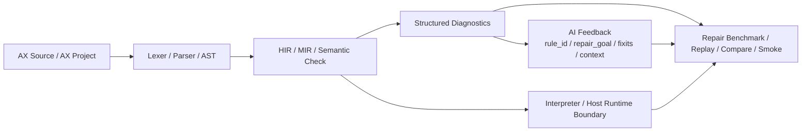

<div align="center">
  

# AX

### 面向 Coding AI 的源码协议与执行语言原型

[](https://github.com/AX-FDN/AX/actions/workflows/ci.yml)
[](./LICENSE)
[](./规划.md)
[](./docs/diagnostics-schema.md)
[](./docs/repair-benchmark.md)
[](./SYNTAX.md)

</div>

AX 是一个面向 Coding AI 的源码协议项目，也是一个持续工程化的执行语言原型。
它把源码形态、编译器诊断、修复反馈契约、benchmark 证据链放进同一条链路里，目标是让代码模型在真实任务上生成更稳定、理解更聚焦、修复更可比较。

AX 当前最适合的场景，是小而确定的工具程序：CLI、构建辅助、文本处理、工作区扫描、发布脚本、项目自动化。
仓库已经具备可运行的 `axc check / run / fmt / build`、结构化 `diagnostics`、`--json --ai` 输出、project-backed 多文件组织、第一阶段 `import/module` 模式、AX 侧共享 foundation，以及 repair benchmark 的导出、评分、对比、smoke 与 CI 资产。

## 一眼看懂 AX

| 项目维度 | AX 当前提供什么 |
| --- | --- |
| 项目定位 | `AI-first Source Protocol + Execution Language Prototype` |
| 核心问题 | 什么样的源码形式、诊断结构和修复上下文，更适合 Coding AI 稳定生成与修复代码 |
| 主要场景 | 小型确定性工具程序、自动化脚本、文本处理、工作区扫描、构建辅助 |
| 当前形态 | 编译器前端 + 解释执行 + structured diagnostics + repair contract + benchmark evidence |
| 核心价值 | 把 canonical syntax、diagnostics、repair contract、benchmark 四件事放进同一个可运行仓库 |

## AX 的核心优势

| 优势 | 具体体现 | 对真实使用的意义 |
| --- | --- | --- |
| 同时拥有源码、诊断、修复、benchmark | AX 同时定义语法、结构化诊断、AI 反馈字段、repair case 和 compare 链路 | 设计价值可以直接通过工程链路验证 |
| 约束明确、表面形式稳定 | 显式类型、较少隐式规则、`fmt` 驱动的规范化输出 | 更容易让模型稳定生成，也更容易让人审阅 |
| 编译器反馈可直接给 Agent 消费 | `rule_id`、`repair_goal`、`fixits`、`context_snippets` 等字段已经进入输出层 | 错误反馈可直接进入自动化修复链 |
| 真工具样例已经进入仓库主线 | 仓库里已经有 workspace audit、release snapshot、search report、directory index 等样例 | 可以直接观察 AX 在真实工具型任务上的表达能力 |
| 多文件工程组织开始成型 | `AX.toml + sources` 已经稳定，第一阶段 `import/module` 已接入主线 | foundation 代码与项目私有逻辑开始拥有清晰边界 |
| benchmark 证据链是一等公民 | repair cases、adapter spec、export、score、compare、smoke、CI 都在仓库里 | 项目价值可以靠数据、回放和对比来建立 |

## AX 的工作原理



AX 把一段源码送入编译器后，会同步产出三层结果：

1. 语言前端结果  
   `Lexer -> Parser -> AST -> HIR -> MIR -> Semantic Check`

2. 结构化诊断结果  
   统一的 `Diagnostic` schema，支持文本、JSON 和 AI 增强字段

3. 可回放证据结果  
   repair benchmark、adapter 输出、评分结果、compare 报告、smoke 回归

AX 把“源码如何被模型消费、错误如何被模型修复、修复结果如何被验证”一起工程化。
这也是 AX 和一般实验语言项目最有区分度的地方。

## AX 现在已经具备的成熟度

| 方面 | 当前状态 | 仓库位置 |
| --- | --- | --- |
| 编译器前端 | 已打通 `Lexer -> Parser -> AST -> HIR -> MIR -> Semantic Check` 主链 | [`src/`](./src/) |
| 执行能力 | 已支持解释执行，能够运行真实 tool-style examples | [`src/interpreter.rs`](./src/interpreter.rs) |
| 诊断输出 | 已支持文本诊断、`--json`、`--json --ai` 三层输出 | [`docs/diagnostics-schema.md`](./docs/diagnostics-schema.md) |
| AI 修复反馈 | 已沉淀 `rule_id / repair_goal / fixits / context_snippets` | [`src/ai.rs`](./src/ai.rs) |
| 项目组织 | 已支持 `AX.toml + sources` 的 project-backed 多文件项目 | [`src/project.rs`](./src/project.rs) |
| 模块模式 | 第一阶段 `import/module` 已接入 parser、project、semantic check，并有 smoke 项目验证 | [`examples/project_module_smoke/`](./examples/project_module_smoke/) |
| AX 侧共享库 | 已沉淀 `foundation/cli / report / text / search / file_kind / workspace` | [`foundation/`](./foundation/) |
| 构建产物 | `build` 已稳定导出 `source.ax`、HIR、MIR、manifest、project-sources 快照 | [`src/build.rs`](./src/build.rs) |
| benchmark 证据链 | repair cases、adapter、export、score、compare、smoke、CI 均已进入仓库主线 | [`docs/repair-benchmark.md`](./docs/repair-benchmark.md) |
| 平台支持 | Windows 工作流最完整；Linux 已打通核心 compiler/runtime 命令 | [`docs/platform-support.md`](./docs/platform-support.md) |

## 我们现在在做什么

当前主线聚焦把下面几件事做硬：

| 当前主线 | 目的 | 结果会体现在哪里 |
| --- | --- | --- |
| 稳定 repair contract 与 benchmark evidence | 让每次变更都能进入可回放、可对比、可评分的证据链 | `benchmarks/`、`scripts/`、`docs/benchmark-showcase.md` |
| 做硬 host runtime boundary | 让 AX 真正能承载工具程序 | `process / env / path / fs / string` 内建能力与 project 样例 |
| 推进最小可写工具内核 | 继续补最值钱的表达能力和 AX 侧 foundation | `foundation/`、`examples/project_*` |
| 推进显式、确定的模块组织 | 让 shared foundation 和 project-private logic 有清晰边界 | `AX.toml + sources`、`module`、`import`、全限定名 |
| 用代表性样例反向驱动语言设计 | 每补一项能力，都要求它能支撑一个更真实的工具样例 | `examples/`、`tests/interface_snapshots.rs` |

这条主线的判断标准很直接：
新能力需要同时提升可写性、可测性、可修复性，才能进入更高优先级。

## 快速理解 AX 现在能做什么

### 1. 单文件 AX 程序

```ax
struct Point {
    x: i32,
    y: i32,
}

fn total(point: Point) -> i32 {
    return point.x + point.y;
}

fn main() -> i32 {
    let mut point: Point = Point { x: 2, y: 3 };
    point.x = point.x + 1;
    println(total(point));
    return 0;
}
```

### 2. 多文件项目与模块模式

```toml
manifest_version = 1

[package]
name = "project_module_smoke"
entry = "src/main.ax"
sources = ["lib"]
```

```ax
import lib.report;

fn main() -> i32 {
    let summary: lib.report.Summary = lib.report.build_summary();
    return summary.count;
}
```

```ax
module lib.report;

struct Summary {
    count: i32,
}

fn build_summary() -> Summary {
    return Summary { count: 7 };
}
```

### 3. 命令行链路

```powershell
rustup toolchain install stable-x86_64-pc-windows-gnu --profile minimal -c rustfmt
.\scripts\cargo-gnu.ps1 build
.\target\debug\axc.exe check examples\hello.ax
.\target\debug\axc.exe run examples\workspace_audit.ax -- . target\workspace-audit.txt
.\target\debug\axc.exe check examples\missing_semicolon.ax --json --ai
```

## 真实样例与代表性工作负载

AX 当前靠代表性样例证明自己。

| 样例 | 说明 | 它证明什么 |
| --- | --- | --- |
| [`examples/workspace_audit.ax`](./examples/workspace_audit.ax) | 工作区扫描与摘要报告 | AX 能写真实文本/目录审计工具 |
| [`examples/docs_release_snapshot.ax`](./examples/docs_release_snapshot.ax) | 文档快照、复制、收据与汇总 | AX 能写发布辅助与文件处理逻辑 |
| [`examples/workspace_search_report.ax`](./examples/workspace_search_report.ax) | 关键字搜索与匹配报告 | AX 能承载递归扫描和报告生成 |
| [`examples/project_directory_index/`](./examples/project_directory_index/) | project-backed 目录索引工具 | foundation 与项目私有逻辑已经能协同 |
| [`examples/project_release_promote/`](./examples/project_release_promote/) | 构建产物整理与提升 | path/fs 边界已经可用于真实自动化流程 |
| [`examples/project_text_normalize/`](./examples/project_text_normalize/) | 文本读取、重写、输出报告 | 文本处理链条已经具备基础可写性 |
| [`examples/project_module_smoke/`](./examples/project_module_smoke/) | 第一阶段模块模式 smoke 工程 | `import/module` 已经进入主线验证链 |

## 当前已经落地的语法面

更完整的规则、边界与 EBNF 请看 [`SYNTAX.md`](./SYNTAX.md)。

### 顶层与项目组织

| 语法面 | 当前状态 | 说明 |
| --- | --- | --- |
| `fn` | 已支持 | 显式参数类型、显式返回类型 |
| `struct` | 已支持 | 结构体声明、字面量、字段访问 |
| `enum` | 已支持 | 枚举声明、`EnumName.Variant` 值 |
| `module ...;` | 已支持第一版 | support source 显式声明模块路径 |
| `import ...;` | 已支持第一版 | entry / support source 显式导入模块 |
| `AX.toml + sources` | 已支持 | project-backed 多文件组织主路径 |

### 语句能力

| 语法面 | 当前状态 | 说明 |
| --- | --- | --- |
| `let` / `let mut` | 已支持 | 局部变量必须显式类型 |
| 赋值 | 已支持 | 支持变量、结构体字段路径、数组元素路径 |
| `return` | 已支持 | 函数路径会做缺失返回检查 |
| `if / else` | 已支持 | 条件必须为 `bool` |
| `while` | 已支持 | 可与 `break;` / `continue;` 配合 |
| `for (init; cond; step)` | 已支持 | 当前主循环表头形态 |
| `break;` | 已支持 | 只能出现在 `while` / `for` 中 |
| `continue;` | 已支持 | 已打通 `for -> while` lowering 下的 step 语义 |
| `match (...) { ... }` | 已支持第一版 + `match v2` 前两刀 | 语句形态、表达式形态与简单绑定 catch-all 都已进入 parser / semantic / interpreter / AI feedback 主链 |

### 表达式与类型能力

| 语法面 | 当前状态 | 说明 |
| --- | --- | --- |
| 基础类型 | 已支持 | `bool` `i32` `f32` `string` `string_list` |
| 结构体值 | 已支持 | `Point { x: 1, y: 2 }`、`point.x` |
| 枚举值 | 已支持 | `Flag.On`、枚举值比较 |
| 固定长度数组 | 已支持 | `[Type; N]`、数组字面量、索引读取 |
| 只读 slice | 已支持 | `[Type]`、`values[start:end]` |
| `for in` 遍历 | 已支持 | 第一版只支持 `for (let value: T in values) { ... }`，目标为数组 / slice |
| 表达式 `match` | 已支持前两刀 | 当前支持 `match (flag) { true => 1, other => 0 }` 这类单表达式 arm，所有 arm 必须返回同类型 |
| 嵌套可写路径 | 已支持 | `outer.inner.value = ...`、`items[index].field = ...` |
| 逻辑运算 | 已支持 | `&&`、`||`，并按短路语义执行 |
| 余数运算 | 已支持 | `%`，当前按 `i32` 运算处理 |
| 字符串拼接 | 已支持 | `string + string` |
| 常用 helpers | 已支持 | `len(value)`、`string_len(text)`、`to_string(value)` |
| `string_list` helpers | 已支持 | `string_list_new / push / join` |

### 最近补进并已经进入主链的语法点

这些不是“文档规划”，而是已经接进编译器、运行时、AI 反馈和回归链的能力：

- `continue;`
  - 已支持在 `while` / `for` 中使用
  - `for` 场景下会先执行 step，再进入下一轮
- 最小 `match`
  - 当前同时支持语句形态、表达式形态与最终裸标识符绑定模式
  - pattern 目前支持 `true` / `false`、整数、枚举值、最终 `_` 与最终裸标识符（如 `other`）
  - 裸标识符 pattern 是 catch-all 绑定，只在当前 arm 内引入一个不可变局部名
  - 会做穷尽检查：
    - `bool` 要覆盖 `true / false` 或最终 catch-all
    - enum 要覆盖全部 variant 或最终 catch-all
    - `i32` 当前需要最终 `_` 或最终绑定
  - 表达式形态当前收敛为 `match (value) { pattern => expr, ... }`，所有 arm 必须返回同类型
- 第一阶段 `module / import`
  - support source 使用 `module ...;`
  - entry 与 support source 都可写显式 `import ...;`
  - 当前采用全限定名跨模块调用，如 `lib.report.build_summary()`
- 逻辑与 / 或 `&&` / `||`
  - 已支持
  - 语义层要求两边都为 `bool`
  - 运行时按短路语义执行，不会无意义地强制求值右侧
- 余数运算 `%`
  - 已支持
  - 当前只接受 `i32` 操作数
  - 运行时会检查 `% 0`
- 第一版 `for in`
  - 已支持 `for (let value: T in values) { ... }`
  - 当前只覆盖数组 / slice
  - loop variable 仍保持 AX 的显式类型风格，不走隐式推断
- 数组 / slice / 嵌套写路径
  - 已不只是“能读数组”，而是能支持固定长度数组、slice、数组元素赋值、结构体字段路径赋值和数组元素字段路径赋值

### 一个更接近当前 AX 水位的语法片段

```ax
module lib.report;

enum Flag {
    On,
    Off,
}

struct Summary {
    count: i32,
}

fn classify(flag: Flag, values: [i32]) -> Summary {
    let mut total: i32 = 0;

    for (let mut i: i32 = 0; i < len(values); i = i + 1) {
        if (i == 1) {
            continue;
        }
        total = total + values[i];
    }

    let count: i32 = match (flag) {
        Flag.On => total,
        Flag.Off => 0,
    };

    return Summary { count: count };
}
```

上面这段代码把当前已经落地的几条关键语法放在一起：

- `module`
- `enum`
- `struct`
- slice 参数
- `for`
- `continue`
- 最小 `match` + 表达式 `match` + 简单绑定 pattern
- 结构体字面量返回

## 多文件项目与第一阶段模块模式

AX 当前采用“manifest 控制文件集合，module/import 控制命名边界”的方式组织工程。

| 层级 | 当前做法 |
| --- | --- |
| 文件发现 | 继续由 `AX.toml` 的 `[package].sources` 控制 |
| 入口文件 | 继续由 `entry` 指定，并保持 manifest-owned root unit |
| 支撑文件 | support source 可以是单个 `.ax` 文件，也可以是目录 |
| 模块声明 | 支撑文件在模块模式下使用显式 `module ...;` |
| 导入方式 | 入口或支撑文件通过显式 `import ...;` 引入模块 |
| 跨模块引用 | 采用全限定名，如 `lib.report.build_summary()` |
| 设计风格 | 第一阶段追求显式、确定、可检查、可映射 |

这个设计的关键点是：

- `AX.toml` 继续作为项目文件集合的唯一来源
- `module` 路径由 source root 与文件路径推导并校验
- foundation 代码与项目私有代码开始拥有清晰命名边界
- `check / run / fmt / build` 依旧围绕整个 manifest 项目运作

对应设计文档见 [`docs/import-module-minimal-design.md`](./docs/import-module-minimal-design.md)。

## AX 的诊断与修复链为什么重要

AX 的诊断层直接服务于修复链。

一个 AX 诊断可以同时提供：

- 文本错误信息
- 结构化 JSON diagnostics
- AI 可消费的 `rule_id`
- 明确的 `repair_goal`
- 可操作的 `fixits`
- 与当前错误直接相关的 `context_snippets`

这意味着 AX 的编译器反馈可以直接进入 Coding AI 的修复上下文，减少临时 prompt 拼接。
这也是 [`src/ai.rs`](./src/ai.rs) 和 [`docs/diagnostics-schema.md`](./docs/diagnostics-schema.md) 在仓库中如此核心的原因。

AX 的 AI 增强反馈不是样例驱动，而是规则驱动：只要新输入的 AX 代码命中了当前已经注册的诊断家族，编译器就会按稳定 `rule_id` 和上下文切片生成增强反馈，而不是只对仓库里的 `examples/` 特判。

当前已经进入 AI 增强反馈主链的报错家族，主要包括：

- 词法与基础语法错误：非法字符、字符串字面量问题、缺分号、缺右括号 / 中括号 / 花括号、缺类型名、缺表达式、顶层声明错误
- 高频语义错误：未定义变量、不可变赋值、`main` 缺失或签名不合法、函数参数数量不匹配、结构体字段错误、缺少 `return`、高价值 `S0022` 类型错误变体（如条件不是 `bool`、函数参数类型不匹配、数组索引类型错误、`len(...)` 参数不合法）
- 模块与项目组织错误：入口文件误写 `module`、support source 缺少 `module`、模块路径与文件路径错配、重复模块、重复 `import`、导入不存在模块、跨模块引用缺少 `import`
- 首批运行时 / 宿主边界错误：整数溢出、除零、数组索引越界、`argv_get` 负索引 / 越界、环境变量缺失、不可读文件 / 目录、`process_run` 启动失败、`process_capture` 非零退出

这也意味着：AX 现在的 AI 反馈已经能对“随手新写的一段错误代码”生效，但还不是“所有可能错误都已覆盖”；当前策略是先把高频、高价值、可回归的错误家族做硬，再持续扩覆盖面。

## AX 的 benchmark 证据链

AX 的 benchmark 是主线能力的一部分。

当前仓库已经包含：

- repair cases 与 expected contract
- repair candidate 资产
- export / score / compare 脚本
- smoke 与 replay 回归
- benchmark 展示文档与结果入口

对应入口：

- [`docs/repair-benchmark.md`](./docs/repair-benchmark.md)
- [`docs/repair-adapter-spec.md`](./docs/repair-adapter-spec.md)
- [`docs/benchmark-showcase.md`](./docs/benchmark-showcase.md)

AX 希望最终回答的是：

1. 同一个坏例子上，模型在 AX 上是否更容易单轮修好  
2. 同一个任务上，结构化诊断是否更容易被模型消费  
3. 同一种语义下，AX 的源码形式是否更利于稳定生成  
4. 同一批 case 上，结果能否被稳定回放、评分和比较

## Quickstart

平台入口：

- [`docs/quickstart.md`](./docs/quickstart.md)
  Windows / Linux 总入口
- [`docs/quickstart-windows.md`](./docs/quickstart-windows.md)
  Windows 完整工作流入口
- [`docs/quickstart-linux.md`](./docs/quickstart-linux.md)
  Linux 核心 compiler/runtime 入口
- [`docs/platform-support.md`](./docs/platform-support.md)
  平台支持分层说明

## 文档导航

- [`SYNTAX.md`](./SYNTAX.md)
  当前语法、内建类型、内建函数、示例与 EBNF
- [`docs/diagnostics-schema.md`](./docs/diagnostics-schema.md)
  结构化 diagnostics 与 AI 增强字段
- [`docs/repair-benchmark.md`](./docs/repair-benchmark.md)
  benchmark 资产、导出链路、评分与 compare 方式
- [`docs/repair-adapter-spec.md`](./docs/repair-adapter-spec.md)
  外部 repair adapter 的输入输出契约
- [`docs/host-runtime-boundary.md`](./docs/host-runtime-boundary.md)
  AX 接口层、Rust 宿主实现层、未来包系统边界
- [`docs/import-module-minimal-design.md`](./docs/import-module-minimal-design.md)
  第一阶段 `import/module` 规则与迁移边界
- [`docs/why-not-language-subsets.md`](./docs/why-not-language-subsets.md)
  为什么 AX 要把 canonical syntax、diagnostics、repair contract、benchmark 一起拥有
- [`docs/killer-demo.md`](./docs/killer-demo.md)
  适合对外展示的短 demo 脚本
- [`docs/benchmark-showcase.md`](./docs/benchmark-showcase.md)
  当前 benchmark 展示页
- [`WORKLIST.md`](./WORKLIST.md)
  当前施工项、优先级与完成记录
- [`规划.md`](./规划.md)
  项目阶段与推进顺序

## 当前阶段的对外理解

AX 现在已经是一个可以检查、运行、格式化、组织项目、输出结构化诊断、跑 benchmark 的原型仓库。
它正在把“给 Coding AI 用的源码协议与修复协议”这件事，从概念推进成可运行、可验证、可对比的工程系统。

对 AX 更准确的理解是：

- 一套面向 Coding AI 的源码约束
- 一条可消费的编译器反馈链
- 一套可回放的修复 benchmark 方法
- 一个持续向真实工具工作负载推进的执行语言原型

如果这条路线继续成立，AX 的价值会同时落在三个层面：

- 语言本体
- 编译器诊断与修复协议
- benchmark 与证据方法学

这也是 AX 值得持续关注的原因。
