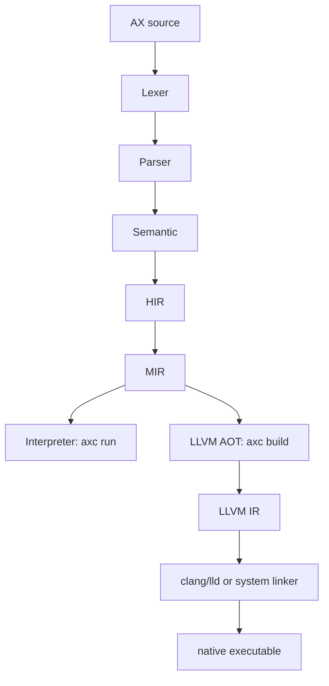

<div align="center">
  

# AX

### AI 时代的语言

#### 为 Codex、Claude Code、Cursor 等 Coding Agent 设计的 AI-native 语言

[](./LICENSE)
[](./docs/release-0.1-alpha.md)
[](./docs/llvm-aot.md)
[](./docs/package-registry-v0.md)

</div>

AX 是一门面向 AI 时代的编程语言，也是一套围绕 Coding Agent 工作流设计的语言工具链。

它的第一类使用场景很明确：让 Codex、Claude Code、Cursor 这类 Coding Agent，以及和这些 agent 协作的人类开发者，更稳定地生成代码、理解项目、修复错误、验证修改。

在 AI 参与写代码的时代，语言不能只回答“这段代码能不能运行”。它还应该回答更多问题：哪里错了，属于哪一层，能不能自动修，修完该跑什么验证，如果后端暂时不支持，AI 应不应该改用户源码。AX 正是围绕这些问题设计的。

所以 AX 不只是语法，也不只是解释器。它把语言前端、解释器、AOT 编译器、结构化诊断、AI 上下文、build manifest、repair benchmark、包生态和验证脚本放在同一条工具链里，让 agent 看到的不再是一堆零散输出，而是一套可以继续推理、修改和验证的工程协议。

一句话说：

```text
AX 要做的是 AI 时代的语言：
同一份源码，解释器能跑，AOT 能编，错误能分层，AI 能知道该怎么修。
```

当前公开边界是：

```text
AX 0.1 Alpha / Developer Preview
interpreter-stable + LLVM AOT v0 executable-capable subset
0.2 Package Preview in progress
```

AX 当前处在 `0.1 Alpha / Developer Preview` 阶段，正在从“可验证的语言工具链”走向成熟后端系统语言。它还不是 1.0，也不会在这个阶段宣称替代 Go、Rust、MoonBit、Python 或 TypeScript；但它已经具备共享前端、稳定解释执行、LLVM AOT 可执行子集、结构化 AI 诊断、项目上下文协议、repair benchmark、包预览和一批标准库基础模块。

## Benchmark 证据快照

AX 现在有几套仓库内 benchmark。它们的定位是：证明 AX 的诊断、AI repair contract、context bundle、adapter 契约和评分脚本能在同一条链路里稳定复跑。它们不是第三方权威 benchmark，也不是跨语言、跨模型的公开排行榜。

| Benchmark | 测什么 | 当前规模 | 当前可复现结果 | 复现脚本 |
| --- | --- | --- | --- | --- |
| Repair smoke | 从坏例子导出 `cold/base/ai` bundle，调用 replay adapter，再用 `axc check/run` 评分。 | full manifest `43` case；smoke manifest `13` case。 | `ai` replay smoke：`13/13` passed。 | [`smoke-repair-benchmark.ps1`](./scripts/smoke-repair-benchmark.ps1) |
| Diagnostics cost | 对同一批 check 型坏例子比较 `check`、`check --json`、`check --json --ai` 的本地开销。 | smoke 中 `11` 个 check case，三种 mode。 | schema/summary smoke 已通过；具体毫秒数只代表本机本次运行。 | [`smoke-benchmark-diagnostics.ps1`](./scripts/smoke-benchmark-diagnostics.ps1) |
| Feedback compare | 比较基础 JSON diagnostics 和 AI-enhanced diagnostics 对修复结果的差异。 | smoke `13` case，deterministic replay。 | `base 7/13 -> ai 13/13`，提升 `+6` case / `+46.15pp`。 | [`smoke-compare-repair-feedback.ps1`](./scripts/smoke-compare-repair-feedback.ps1) |
| Mode ladder | 比较 `cold -> base -> ai` 三档输入给 repair 链路带来的增量。 | smoke `13` case，deterministic replay。 | `cold 5/13 -> base 7/13 -> ai 13/13`；`cold -> ai` 提升 `+8` case / `+61.54pp`。 | [`smoke-compare-repair-modes.ps1`](./scripts/smoke-compare-repair-modes.ps1) |

复现时统一使用：

```powershell
powershell -NoProfile -ExecutionPolicy Bypass -File .\scripts\<smoke-script>.ps1
```

对外表述时，最准确的说法是：

| 可以说 | 不应该说 |
| --- | --- |
| AX 有一条仓库内可复现的 repair evidence loop。 | AX 已经拿到了权威 benchmark 成绩。 |
| `--json --ai` 在当前 AX 自有 case 和 deterministic replay 下能提供可测的修复增量。 | AX 已经证明比 Rust、Go、Python、TypeScript 更适合 AI 写代码。 |
| diagnostics、context、repair bundle、score/compare 已经进入同一套机器可消费协议。 | 当前结果等价于 live-model、跨语言、第三方可审计的公开 benchmark。 |

完整说明见 [`docs/repair-benchmark.md`](./docs/repair-benchmark.md)、[`docs/diagnostics-benchmark-schema.md`](./docs/diagnostics-benchmark-schema.md) 和 [`docs/benchmark-showcase.md`](./docs/benchmark-showcase.md)。

## 为什么 AX 是 AI-native

很多语言是先为人设计，再让 AI 去适应。AX 的思路是：人当然要能读、能写、能维护，但 Coding Agent 也必须是一等使用者。

这里说的 Coding Agent 不是抽象概念，而是 Codex、Claude Code、Cursor，以及未来类似的自动编程助手。它们会读源码、改源码、跑命令、看报错、继续迭代，直到项目通过验证。AX 想服务的，就是这种真实工作流。

在这种工作流里，AI 最怕的不是“语法不会”，而是这几件事：

- 错误信息太散，分不清是语法错、类型错、运行时错、后端不支持，还是工具链缺失。
- 项目一大，AI 不知道哪些文件重要、函数怎么流动、修改哪里风险最大。
- 修完以后只靠猜，不知道该跑 `check`、`run`、`build`、package smoke，还是 benchmark。
- 后端不支持某个合法语法时，AI 可能误以为用户代码错了，然后乱改业务逻辑。

所以 AX 的设计目标不是“让模型背会一套新语法”，而是让 Coding Agent 在工作流里拿到更明确的机器可读信号：

- 这个错误是哪一层报的。
- 这个错误该不该改用户源码。
- 如果要改，修复目标是什么。
- 如果不能改，是 AOT 后端、runtime ABI、包成熟度还是工具链问题。
- 改完以后应该跑哪些命令验证。

AX 把这些问题做成编译器的一等输出。对人来说，它是更清楚的错误解释；对 agent 来说，它是下一步行动的判断依据：

| 能力 | AX 怎么做 |
| --- | --- |
| 分层错误 | lexer / parser / semantic / interpreter / AOT readiness / runtime ABI / LLVM lowering / toolchain link / package registry 都应该有清楚层级。 |
| 结构化诊断 | `axc check --json --ai` 可以给出 rule id、repair goal、fixit、上下文片段和验证建议。 |
| AI 上下文 | `axc context` 输出 overview、boundaries、topology、flow、symbol、impact、evidence 等视图。 |
| 双路径验证 | `axc run` 是解释器语义参考，`axc build` 把支持子集编到 native exe，再做 run-vs-exe parity。 |
| benchmark 证据 | repair benchmark、snapshot、smoke 和 deterministic replay 用来证明修复能力，而不是只靠口号。 |

AX 的目标不是“AI 看报错猜一下怎么改”，而是：

```text
AI 读结构化错误
  -> 判断是源码问题、后端能力缺口、包问题还是工具链问题
  -> 修改源码或解释限制
  -> 跑 check / run / build / pkg / benchmark
  -> 根据新结果继续收敛
```

换成真实 Coding Agent 工作流，就是：

| Agent 正在做什么 | AX 应该给它什么 |
| --- | --- |
| Codex / Claude Code / Cursor 生成第一版代码 | 清晰语法、稳定 formatter、可预测的 semantic error。 |
| Agent 看见 `axc check` 失败 | `--json --ai` 给出错误层级、rule id、repair goal、fixit 和 safe-to-edit 信号。 |
| Agent 不知道项目怎么改 | `axc context` 给出项目 overview、模块边界、调用流、符号、影响范围和证据。 |
| Agent 改完想验证 | `axc check / run / build / pkg` 和 smoke 脚本提供固定验证入口。 |
| Agent 遇到 AOT 不支持 | `build-manifest.json` 和 `aot_readiness.blockers` 告诉它不要乱改业务逻辑，而是解释后端限制或补后端。 |
| Agent 要证明修复真的变好 | repair benchmark、snapshot、run-vs-exe parity 给出可重复证据。 |

这就是 AX 和普通小语言项目最大的区别。

## 现在 AX 做到哪里了

如果只想快速判断 AX 现在是不是“已经有东西了”，可以先看这一张表。它不是未来愿景，而是当前仓库已经落地、正在验证的能力边界。

| 模块 | 当前状态 |
| --- | --- |
| CLI | `axc check / run / fmt / build / context / pkg` 已在主线。 |
| 前端 | lexer、parser、semantic、HIR、MIR 由解释器、构建、上下文、AOT 共享。 |
| 解释器 | `axc run` 是当前语言主线的稳定语义参考。 |
| AOT 编译器 | LLVM AOT v0 已能为支持子集生成 IR，并在 clang/linker 可用时生成 native executable。 |
| AOT parity | 默认 run-vs-exe parity 覆盖 `123` 个 case，其中包含 `26` 个 `AX.toml` project case。 |
| Project mode | 仓库内 `26` 个 `AX.toml` project examples 已全部进入默认 AOT parity 清单。 |
| Build manifest | `build-manifest.json` schema version 是 `10`。 |
| AOT readiness | `aot_readiness.schema_version` 是 `3`。 |
| 诊断 | 文本输出、`--json`、`--json --ai` 都已存在。 |
| 上下文 | `overview / boundaries / topology / flow / symbol / impact / evidence` 已由编译器输出。 |
| Agent 接口 | diagnostics、context、build manifest、AOT readiness、repair benchmark 都按 Coding Agent 可消费的方向设计。 |
| 包系统 | local path package v0、`AX.lock` v0、registry metadata、`axc pkg`、checksum-backed install preview 已存在。 |
| 包目录 | registry catalog 有 `32` 个 curated packages，stable pure-AX smoke 覆盖 `30` 个包。 |
| 标准库基础 | `std.bytes`、`std.encoding`、`std.json`、`std.hash`、`std.http` 已作为包和后端路线的基础。 |
| 1.0 路线 | `docs/release-1.0-backend-systems.md` 已把目标收成 Backend Systems Language。 |

所以，AX 当前不是一份停在概念阶段的语言草案。它已经有能运行的解释器、能生成可执行文件的 AOT 子集、能被 agent 消费的诊断和上下文、能验证修复的 benchmark，以及正在成形的 package preview。

接下来最重要的事不是随机堆功能，而是把这些已经存在的能力继续收稳：包系统要进入真实协作，语言规格要冻结，runtime ABI 要清楚，AOT 后端要走向 Backend Profile v1，标准库、async/IO、IDE/LSP 再沿着这条主线推进。

## 解释器和编译器是同一门语言

很多新同学会问：`axc.exe` 到底是解释器还是编译器？

答案是：**它是 AX 的工具链入口，里面同时包含解释器路径和编译器/AOT 路径。**



解释器和 AOT 不是两套语言。它们共享同一个前端：

- `axc check`：只检查，不执行。
- `axc run`：走解释器，直接执行 AX 程序，是当前语义参考。
- `axc build`：走构建/AOT 路径，导出 HIR/MIR/LLVM IR/manifest，并在支持时生成 exe。
- `axc context`：基于同一套前端和项目分析，给 AI 输出架构上下文。
- `axc pkg`：管理 curated registry/package preview。

这意味着后续加语法时，正确路径不是“解释器加一套，编译器再猜一套”，而是：

```text
语法设计
  -> parser 支持
  -> semantic 明确类型和规则
  -> HIR/MIR lowering
  -> interpreter 执行
  -> AOT readiness 给出支持或 blocker
  -> AOT lowering 逐步补 native
  -> tests / snapshots / parity 验证
```

这种共享前端是 AX 能长期长大的基础。

## AOT 后端现在是什么水平

AX 的 AOT 当前是：

```text
LLVM AOT v0 executable-capable subset
```

这句话很重要，它的意思是：

- 不是只有 IR 展示。AX 已经能在支持子集上生成 native executable。
- 不是成熟 native backend。它还在按能力包扩张，不能说已经达到 Go/Rust 这种成熟度。
- 它已经能通过 run-vs-exe parity 证明解释器和 native 输出一致。
- 它的失败会尽量进入 `aot_readiness.blockers`、lowering diagnostic、runtime ABI blocker 或 toolchain/link blocker，而不是伪装成用户源码错误。

当前 AOT parity 的事实：

```text
default parity cases: 123
project parity cases: 26
repo AX.toml project examples listed: 26 / 26
```

AOT 当前已经覆盖不少核心能力：基础类型、函数、控制流、数组、slice、struct、enum、payload enum、match、Result/Option 风格、部分泛型实例、字符串 runtime、路径/文件/环境/进程相关 host Result lowering 的一批入口，以及 package/project-backed parity 的基础切片。

最近后端还在往 Backend Profile v1 收：

- `scripts/smoke-backend-profile-v1.ps1` 已作为后端画像代表 smoke。
- host/network runtime smoke 已验证本地 TCP-backed `std.http` / `std.net` 行为和 `AOT0301/runtime_abi` blocker。
- AOT 对部分 host Result API 已经有 lowering 入口，例如 `std.env.try_get`、`std.fs.try_read_to_string`、`std.fs.try_read_dir`、`std.process.try_run` 等。

长期目标不是“能编几个 demo”，而是：

```text
Backend Profile v1 内的程序：
axc check 通过
axc run 通过
axc build --emit exe 通过
native exe 与解释器输出 parity 一致
```

## build 会产出什么

AX 的 `build` 不只是“吐一个 exe”。成熟编译器要给用户交付物，也要给 AI 和 CI 证据。

典型构建产物会围绕这些内容：

```text
build/<target>/
  source.ax
  program.hir.json
  program.mir.json
  generated/main.ll
  bin/<target>.exe
  build-manifest.json
```

可以这样理解：

| 产物 | 用途 |
| --- | --- |
| `source.ax` | 构建时使用的源码证据。 |
| `program.hir.json` | 高级中间表示，方便看前端降级结果。 |
| `program.mir.json` | 中级中间表示，方便看控制流和后端输入。 |
| `generated/main.ll` | LLVM IR，方便调试 AOT lowering。 |
| `bin/<target>.exe` | 用户真正运行的 native executable。 |
| `build-manifest.json` | 构建合同，记录 emit、artifacts、readiness、blockers、schema 等信息。 |

常用命令：

```powershell
axc build examples/aot_return.ax --emit ir
axc build examples/aot_return.ax --emit exe
axc build examples/aot_return.ax --emit all
axc build examples/aot_return.ax --no-link
```

`build-manifest.json` 是 AX 非常重要的设计点。它让 AI 和 CI 能判断失败来自哪里：

- 用户源码不合法
- AOT 子集暂不支持
- runtime ABI 还没冻结
- clang/linker 缺失
- package maturity 阻塞
- 编译器内部错误

这就是“错误分层让 AI 自己判断该不该改源码”的基础。

## 包生态：0.2 Package Preview

AX 已经开始做包生态，但路线是谨慎而可验证的。

当前包源仓库是：

```text
https://github.com/AX-FDN/AX-PKG.git
```

AX 主仓库维护 curated registry metadata，AX-PKG 存放包源码。用户使用包时，`axc pkg` 根据主仓库里的 registry metadata 找到包的位置、revision、path、checksum，然后安装到本地缓存并参与 check/run/build。

当前包系统能力：

```text
axc pkg search
axc pkg info
axc pkg check
axc pkg tree
axc pkg add
axc pkg install
axc pkg hash
```

包成熟度分三类：

| Maturity | 含义 |
| --- | --- |
| `stable_pure_ax` | 纯 AX 包，不依赖 host/native 边界，是当前最适合进入 smoke 和 AOT parity 的包。 |
| `host_boundary_preview` | 包语义需要文件、网络、进程、环境等 host 能力，解释器可先行，AOT 需要 runtime ABI 支撑。 |
| `future_native_preview` | 未来需要更完整 native runtime、FFI、TLS、DB、crypto 等能力，当前主要用于规划和接口设计。 |

当前 registry catalog 有 `32` 个 curated packages，stable pure-AX smoke 覆盖 `30` 个包。这个阶段不做 npm/crates.io 式公开上传服务器，不做账号系统，不安装任意 native binary，也不执行任意安装脚本。AX 先选择 curated PR 模式，让生态从可审查、可校验、可复现开始。

更多看：

- [docs/package-registry-v0.md](./docs/package-registry-v0.md)
- [CONTRIBUTING.md](./CONTRIBUTING.md)

## 标准库当前边界

AX 的 `std.*` 已经不是空壳，但仍处在基础建设阶段。

当前面向包和后端路线的基础包括：

| 模块 | 当前定位 |
| --- | --- |
| `std.bytes` | byte buffer 基础，支撑 encoding、HTTP、TLS、DB 的后续 ABI。 |
| `std.encoding` | hex/base64 等编码辅助。 |
| `std.json` | 当前是确定性的 JSON 构造/字符串辅助，后续要走向 encode/decode v1。 |
| `std.hash` | 确定性非加密 checksum helper，不等于安全 crypto。 |
| `std.http` | pure request/status/header helper，加上 host-boundary preview。 |
| `std.fs` / `std.env` / `std.process` / `std.path` | host 能力基础，正在和 Result/error/runtime ABI 对齐。 |

需要说清楚：AX 后面会做 HTTP/TLS/DB/async，但这些不能靠解释器“偷跑”。真正成熟之前，要先把 runtime ABI v1、host handle、bytes/string ownership、Result error mapping、native linking 和 AOT readiness blocker 做清楚。

## 新手快速开始

先构建或准备 `axc`，然后写一个 AX 文件：

```ax
fn main() -> i32 {
    println("hello AX")
    return 0
}
```

检查：

```powershell
axc check examples/aot_return.ax
```

运行解释器：

```powershell
axc run examples/aot_return.ax
```

构建 AOT IR：

```powershell
axc build examples/aot_return.ax --emit ir
```

如果本机有 clang/linker，构建 native executable：

```powershell
axc build examples/aot_return.ax --emit exe
```

查看 AI 友好的诊断：

```powershell
axc check examples/bad_case.ax --json --ai
```

查看项目上下文：

```powershell
axc context examples/project_package_math --view overview
axc context examples/project_package_math --view topology
axc context examples/project_package_math --view flow
```

查看包：

```powershell
axc pkg search
axc pkg info json_tools
axc pkg tree
```

## 本地验证

Windows 下仓库推荐通过 `scripts/cargo-gnu.ps1` 走统一 cargo 入口：

```powershell
.\scripts\cargo-gnu.ps1 fmt --check
.\scripts\cargo-gnu.ps1 test --lib backend::llvm
.\scripts\cargo-gnu.ps1 test --lib build::
.\scripts\cargo-gnu.ps1 build --quiet
```

AOT 代表 smoke：

```powershell
.\scripts\smoke-backend-profile-v1.ps1
.\scripts\smoke-aot-link.ps1
.\scripts\smoke-aot-parity.ps1
.\scripts\smoke-aot-runtime-errors.ps1
```

包系统 smoke：

```powershell
.\scripts\smoke-package-registry.ps1
.\scripts\smoke-package-registry-aot.ps1
.\scripts\smoke-package-registry-native-parity.ps1
```

不是每次改 README 都需要跑全量测试；但改后端、包系统、diagnostics、manifest、AOT readiness 时，要按变更范围跑对应 smoke。

## 路线图

AX 的路线已经收成一条主线：

```text
0.1 Alpha
  -> 0.2 Package Preview
  -> Language Spec Freeze
  -> Native Runtime ABI v1
  -> Reliable AOT Backend Profile v1
  -> Backend Standard Library v1
  -> Async/IO Runtime v1
  -> Package/Registry Stability
  -> LSP/VSCode
  -> 1.0 Backend Systems Language
```

### 0.1 Alpha

证明 AX 的基本形态成立：

- 同一前端
- 解释器稳定
- AOT v0 可生成 exe
- 错误可分层
- AI 可读 diagnostics/context
- benchmark/parity 能验证

### 0.2 Package Preview

把包系统从“能用”收成可协作地基：

- curated registry metadata
- AX-PKG source package monorepo
- checksum-backed install
- `AX.lock`
- package maturity
- package-backed check/run/build/AOT readiness
- stable pure-AX package smoke

### 1.0 Backend Systems Language

目标是 Windows + Linux 上默认可靠的后端系统语言：

- Backend Profile v1 内默认可靠 AOT
- runtime ABI v1
- JSON / HTTP / TLS / TCP / PostgreSQL / async 的明确路线
- 结构化错误和 AI repair contract 不丢
- VSCode/LSP 基础能力
- 一个真实后端 demo 能 check/run/build

详细路线看：

- [docs/release-0.1-alpha.md](./docs/release-0.1-alpha.md)
- [docs/release-1.0-backend-systems.md](./docs/release-1.0-backend-systems.md)
- [docs/backend-profile-v1.md](./docs/backend-profile-v1.md)

## 现在不要夸大的地方

AX 可以自信介绍自己，但要讲事实。

可以说：

```text
AX 是一个可信的 AI-native language toolchain preview：
它明确面向 Codex、Claude Code、Cursor 等 Coding Agent；
解释器稳定，LLVM AOT v0 已具备可执行子集，结构化诊断/context/manifest/repair/benchmark 是一等能力，
包生态和后端 profile 正在进入收口阶段。
```

不要说：

- AX 已经是 production-ready 1.0。
- AX 已经有成熟 native backend。
- AX 已经有完整 public package registry。
- AX 已经有生产级 HTTP/TLS/DB/async/crypto/IDE。
- AX 已经可以替代 Go/Rust/MoonBit。

这不是自弱，而是保持可信。AX 真正强的地方，是它把语言、编译器、解释器、AOT、AI 反馈、包生态和验证证据放在同一个方向上推进。

## 文档入口

| 想了解 | 看这里 |
| --- | --- |
| 当前事实锚点 | [PROJECT_FACTS.md](./PROJECT_FACTS.md) |
| 对外说法边界 | [docs/public-claims.md](./docs/public-claims.md) |
| 0.1 Alpha 发布边界 | [docs/release-0.1-alpha.md](./docs/release-0.1-alpha.md) |
| 1.0 后端系统语言路线 | [docs/release-1.0-backend-systems.md](./docs/release-1.0-backend-systems.md) |
| AOT 后端 | [docs/llvm-aot.md](./docs/llvm-aot.md) |
| Native ABI | [docs/aot-native-abi.md](./docs/aot-native-abi.md) |
| Backend Profile v1 | [docs/backend-profile-v1.md](./docs/backend-profile-v1.md) |
| 语言能力矩阵 | [docs/feature-matrix.md](./docs/feature-matrix.md) |
| 语言支持状态 | [docs/language-support-status.md](./docs/language-support-status.md) |
| 包注册表设计 | [docs/package-registry-v0.md](./docs/package-registry-v0.md) |
| 贡献指南 | [CONTRIBUTING.md](./CONTRIBUTING.md) |
| 验证矩阵 | [docs/validation-matrix.md](./docs/validation-matrix.md) |
| repair benchmark | [docs/repair-benchmark.md](./docs/repair-benchmark.md) |

## License

AX is released under the [Apache-2.0 license](./LICENSE).
