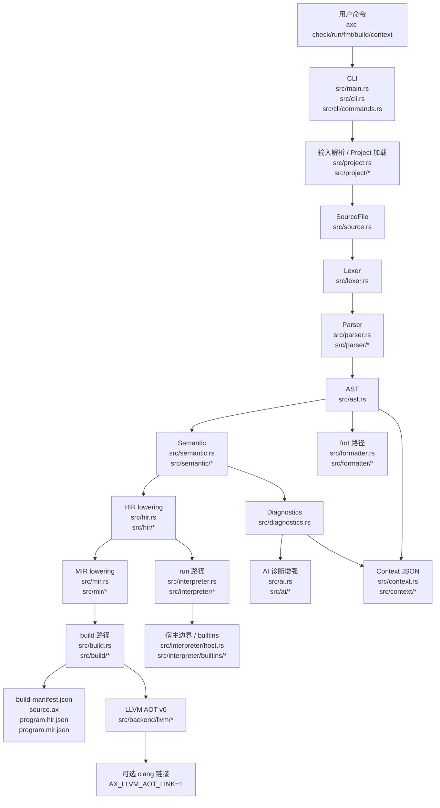

# AX 编译器架构

本文面向刚接手 AX 的维护者。它不替代每个专题文档，而是先回答几个最容易混淆的问题：

- `axc.exe` 到底是什么。
- `check / run / fmt / build / context` 分别经过哪些层。
- 解释执行和 build/AOT 是否共享前端。
- 以后新增语法时，要按什么顺序改代码。
- 这轮模块拆分后，接下来该优先做什么。

本文状态基于 2026-05-05 的代码结构。

## 先建立一个正确心智模型

`axc.exe` 是用 Rust 写出来、再由 `cargo/rustc` 编译出来的 AX 命令行工具。它不是“只包含解释器”的单一程序，而是把这些能力装在同一个 CLI 里：

- 编译器前端：词法、语法、语义检查、HIR lowering、MIR lowering。
- 解释器：`axc run` 成功分析源码后，直接解释执行 HIR。
- build/AOT：`axc build` 成功分析源码后，写出 build artifacts，并在当前支持的 MIR/native 子集上生成 LLVM IR，配置允许时尝试用 `clang` 链接成可执行文件。
- 诊断和 AI 解释：结构化 diagnostics、规则卡片、session、修复提示。
- context 工具：给 AI 或外部工具看的项目概览、边界、拓扑、符号、影响面、证据等 JSON。
- formatter、project/package/lockfile 等周边工具。

所以要分清两层：

- `rustc` 编译的是 AX 编译器本身，也就是 `axc.exe`。
- `axc.exe` 运行时处理的是 `.ax` 源码。

当前 `axc run` 主要是解释执行 `.ax`，不是把 `.ax` 变成机器码。当前 `axc build` 已经有 build artifact 和 LLVM AOT v0 原型，但还不是完整发布级 native compiler。

## 总图



## 命令入口

真正的入口很短：

- `src/main.rs`：收集命令行参数，调用 `axc::run_cli(...)`。
- `src/lib.rs`：公开 crate 模块，并 `pub use cli::run_cli`。
- `src/cli.rs`：命令分发 facade。
- `src/cli/commands.rs`：每个子命令的主流程。
- `src/cli/options.rs`：参数解析。
- `src/cli/render.rs`：CLI 输出和错误渲染辅助。

常用命令的大致路径如下。

| 命令 | 主要作用 | 关键路径 |
| --- | --- | --- |
| `axc check <path>` | 只检查，不执行，不 build | project/source -> lexer -> parser -> semantic -> diagnostics |
| `axc run <path>` | 分析通过后解释执行 | check + HIR/MIR lowering -> HIR interpreter |
| `axc build <path>` | 产出 build artifacts，尝试 LLVM AOT v0 | analyze -> HIR/MIR -> build manifest -> optional LLVM IR/link |
| `axc fmt <path>` | 格式化源码 | load -> parser/AST -> formatter -> 写回文件 |
| `axc ast/hir/mir <path>` | 打印内部表示 JSON | analyze 对应阶段 -> JSON |
| `axc context ...` | 输出给 AI/工具使用的项目上下文 JSON | load/check -> context renderer |
| `axc lock <project>` | 生成或检查 `AX.lock` | project/package dependency graph -> lockfile |

## 前端流水线

前端的总装配在 `src/frontend.rs`：

1. `tokenize(source)`：`src/lexer.rs` 把源码字符串切成 tokens。
2. `parse(source, tokens)`：`src/parser.rs` 和 `src/parser/*` 把 tokens 组装成 AST。
3. `check_program_with_project(...)`：`src/semantic.rs` 和 `src/semantic/*` 做语义检查。
4. `lower_program(...)`：`src/hir.rs` 和 `src/hir/*` 把 AST 降到 HIR。
5. `lower_mir_program(...)`：`src/mir.rs` 和 `src/mir/*` 把 HIR 降到 MIR。

这里有两个常用入口：

- `check_only_with_project(...)`：只走 lexer/parser/semantic，用于 `check`、`fmt` 的诊断前置、`context` 等。
- `analyze_with_project(...)`：语义通过后继续产生 HIR 和 MIR，用于 `run`、`hir`、`mir`、`build`。

关键点：解释器和 build/AOT 可以共享同一个前端。它们不应该各自解析一遍语言，也不应该维护两套语义规则。正确路线是：前端统一决定“这段 AX 程序是否合法、是什么意思”，后面的解释器和 AOT 后端只是消费已经规整过的中间表示。

## 解释执行路径

`axc run` 的核心在 `src/cli/commands.rs::run_run`：

1. 加载 `.ax` 文件或项目入口。
2. 调 `analyze_with_project(...)`。
3. 如果有 diagnostics，直接输出错误；如果带 `--ai`，先做 AI 诊断增强。
4. 如果分析通过，取 `output.hir`。
5. 建立 `RunContext`，捕获命令行参数和宿主环境。
6. 调 `run_program_with_context(source, hir, run_context)`。

解释器模块现在已经拆成更清晰的边界：

| 模块 | 职责 |
| --- | --- |
| `src/interpreter.rs` | facade，导出解释器公共入口 |
| `src/interpreter/value.rs` | 运行时值 |
| `src/interpreter/frame.rs` | 调用帧、局部变量环境 |
| `src/interpreter/runtime.rs` | 运行结果、运行时错误辅助 |
| `src/interpreter/statements.rs` | 语句执行 |
| `src/interpreter/expressions.rs` | 表达式求值 |
| `src/interpreter/assignment.rs` | 赋值和 place 写入 |
| `src/interpreter/binary.rs` | 二元运算 |
| `src/interpreter/collections.rs` | 数组、切片、集合相关行为 |
| `src/interpreter/matches.rs` | match / pattern 运行时逻辑 |
| `src/interpreter/flow.rs` | return、break、continue 等控制流 |
| `src/interpreter/host.rs` | 宿主能力边界 |
| `src/interpreter/builtins/*` | 内置函数，如 fs/path/process/env/string 等 |

解释执行不会把 AX 源码变成汇编或机器码。它是在 Rust 写成的 `axc.exe` 进程里，把 HIR 当作数据结构来执行。

这就是为什么 `axc.exe` 能执行 `.ax`，但当前 `run` 的执行方式仍然不是“把 `.ax` 编译成新的 `.exe`”。

## Build / AOT 路径

`axc build` 的核心在 `src/cli/commands.rs::run_build` 和 `src/build/program.rs`。

当前稳定产物包括：

- `build-manifest.json`
- `source.ax`
- `program.hir.json`
- `program.mir.json`
- 项目模式下复制的 `AX.toml` 和 `project-sources/`
- `artifacts.planned_executable` 字段，表示计划中的可执行文件路径
- 在支持的 LLVM AOT v0 子集上，可能额外有 `generated/main.ll`
- 如果启用链接且工具链可用，可能额外有真正的 `bin/<target>.exe` 或 Linux/macOS 上的 `bin/<target>`

注意 `planned_executable` 和 `executable` 的区别：

- `planned_executable`：计划路径，表示“如果能完整 AOT/link，目标文件应该在这里”。
- `executable`：实际产物。只有 LLVM IR 生成成功，并且 `clang` 链接成功后才会出现。

当前 LLVM AOT v0 主要位于：

- `src/backend/llvm/mod.rs`
- `src/backend/llvm/ir.rs`
- `src/backend/llvm/abi.rs`
- `src/backend/llvm/symbols.rs`
- `src/backend/llvm/runtime/`
- `src/backend/llvm/monomorph.rs`
- `src/backend/llvm/linking.rs`
- `src/backend/llvm/toolchain.rs`

当前 LLVM AOT v0 已经不是“只会生成一点 IR”的原型。它是 executable-capable subset：在有 clang/linker 的环境下，默认 parity smoke 会比较解释器与 native executable 的退出码、stdout 和 stderr。当前默认 parity 覆盖 `123` 个样例，其中 `26` 个是 `AX.toml` project 样例，仓库内全部 project 示例都已列入默认清单。

所以现在要这样理解 build：

- `build` 已经不是空壳，它能稳定导出前端/中端 artifacts，并对当前支持的语言子集生成 LLVM IR 和可选 native executable。
- `build` 还不是成熟发布级 native compiler，不能宣称完整替代解释器路径。
- 后续要继续补齐 native runtime ABI、bytes/string ownership、package/std native linking、跨 package generics/impl/trait ABI、工具链分发和跨平台验证。

## Project / Package / Lockfile

项目加载边界在：

- `src/project.rs`
- `src/project/manifest.rs`
- `src/project/loader.rs`
- `src/project/sources.rs`
- `src/project/dependencies.rs`

它负责识别：

- 单文件输入。
- 项目目录或 `AX.toml`。
- 项目源码列表。
- local path package dependency。
- package graph readiness。

lockfile 相关在：

- `src/lockfile.rs`

build 时，project/package 信息会进入 `BuildInput`，再写入 `build-manifest.json`，因此 build manifest 不只是“编译输出清单”，也是当前 project/package 状态的可复现记录。

## Diagnostics / AI / Context

AX 当前最有价值的工程资产之一，是结构化 diagnostics 和围绕它的 AI/context 工具链。

诊断基础层：

- `src/diagnostics.rs`：诊断结构、渲染、JSON 输出。
- lexer/parser/semantic/interpreter/project/package/build 都可以产生 diagnostics 或错误信息。

AI 诊断增强：

- `src/ai.rs`：AI 诊断 facade 和整体增强流程。
- `src/ai/rules.rs`、`src/ai/rules/*`：规则匹配、rule id、教学卡片内容。
- `src/ai/session.rs`：AI session 反馈记录。
- `src/ai/context_snippets.rs`：诊断上下文片段。

Context JSON：

- `src/context.rs`：context facade。
- `src/context/overview.rs`：项目概览。
- `src/context/boundaries.rs`：边界视图。
- `src/context/topology.rs`：拓扑视图。
- `src/context/flow.rs`：执行/数据流线索。
- `src/context/symbol.rs`：符号视图。
- `src/context/impact.rs`：影响面视图。
- `src/context/evidence.rs`：证据视图。
- `src/context/package.rs`：package 相关上下文。
- `src/context/catalog.rs`、`shared.rs`、`stats.rs`、`types.rs`：共享结构和聚合逻辑。

这三块的关系是：

- diagnostics 告诉用户“错在哪里”。
- AI rules 把错误解释成更像老师的反馈和可执行修复建议。
- context 把项目结构、符号、影响面和证据导出给外部工具或 AI。

## Formatter 路径

formatter 在：

- `src/formatter.rs`
- `src/formatter/items.rs`
- `src/formatter/statements.rs`

`axc fmt` 会先加载并解析源码，再由 formatter 根据 AST 重新渲染。formatter 不应该自己重新理解语言语义；它应该依赖 parser 给出的 AST 结构。

后续新增语法时，formatter 是很容易忘的一层。语法能 parse、能 run，不代表 `fmt` 就已经支持。

## 如果以后新增语法，按这个顺序改

新增语法时，不要从解释器或后端直接开改。推荐顺序如下：

1. 设计语法和最小例子：先写清楚新语法长什么样、应该通过什么例子。
2. Lexer：如果有新关键字、新符号、新字面量，改 `src/lexer.rs` 和 `src/token.rs`。
3. AST：在 `src/ast.rs` 增加语法树节点或字段。
4. Parser：在 `src/parser/*` 里把 tokens 解析成 AST。
5. Formatter：在 `src/formatter/*` 里保证新语法能被稳定格式化。
6. Semantic：在 `src/semantic/*` 里做类型、作用域、控制流、约束检查。
7. HIR：在 `src/hir/*` 里把新 AST 降到解释器更容易消费的结构。
8. MIR：如果 build/AOT 或中端分析需要，改 `src/mir/*`。
9. Interpreter：在 `src/interpreter/*` 里实现 `axc run` 的行为。
10. Build/AOT readiness：即使暂时不支持 native，也要在 `src/build/readiness.rs` 或 LLVM lowering 里给出明确 blocker。
11. LLVM/backend：如果要支持 native，改 `src/backend/llvm/*`，并补链接验证。
12. Diagnostics/AI：给常见错误补 diagnostics 和 AI rule，避免只报内部错误。
13. Tests/snapshots/examples/docs：补单元测试、接口快照、代表样例和文档。

最重要的原则：前端语义只能有一份。解释器、formatter、build/AOT 都应该跟着同一个 AST/HIR/MIR 合约走。

## 修改导航

| 你要改什么 | 优先看哪里 |
| --- | --- |
| 命令行参数或子命令 | `src/cli.rs`、`src/cli/commands.rs`、`src/cli/options.rs` |
| 新 token / 关键字 | `src/token.rs`、`src/lexer.rs` |
| 语法解析 | `src/parser.rs`、`src/parser/*` |
| AST 结构 | `src/ast.rs` |
| 类型检查、作用域、控制流检查 | `src/semantic.rs`、`src/semantic/checker/*` |
| 跨文件/项目级语义信息 | `src/semantic/program_info.rs`、`src/semantic/program_info/*`、`src/project/*` |
| HIR lowering | `src/hir.rs`、`src/hir/*` |
| MIR lowering | `src/mir.rs`、`src/mir/*` |
| `axc run` 行为 | `src/interpreter.rs`、`src/interpreter/*` |
| 内置函数 / 宿主能力 | `src/interpreter/builtins/*`、`src/interpreter/host.rs`、`docs/host-runtime-boundary.md` |
| build manifest | `src/build.rs`、`src/build/*` |
| LLVM IR / AOT | `src/backend/llvm/*`、`docs/llvm-aot.md` |
| 格式化 | `src/formatter.rs`、`src/formatter/*` |
| AI 诊断规则 | `src/ai/rules.rs`、`src/ai/rules/*` |
| AI session / teaching 反馈 | `src/ai/session.rs`、`src/ai.rs` |
| context JSON | `src/context.rs`、`src/context/*` |
| package/local dependency | `src/project/dependencies.rs`、`src/lockfile.rs` |
| 对外接口稳定性 | `tests/interface_snapshots.rs`、`docs/interface-contracts.md` |

## 验证入口

日常改动的基础验证：

```powershell
cargo +stable-x86_64-pc-windows-msvc fmt --check
git diff --check
powershell -NoProfile -ExecutionPolicy Bypass -File .\scripts\cargo-gnu.ps1 test --lib
powershell -NoProfile -ExecutionPolicy Bypass -File .\scripts\cargo-gnu.ps1 test --test interface_snapshots
```

按模块做小范围验证时，可以优先跑：

```powershell
powershell -NoProfile -ExecutionPolicy Bypass -File .\scripts\cargo-gnu.ps1 test --lib parser::
powershell -NoProfile -ExecutionPolicy Bypass -File .\scripts\cargo-gnu.ps1 test --lib semantic::
powershell -NoProfile -ExecutionPolicy Bypass -File .\scripts\cargo-gnu.ps1 test --lib hir::
powershell -NoProfile -ExecutionPolicy Bypass -File .\scripts\cargo-gnu.ps1 test --lib mir::
powershell -NoProfile -ExecutionPolicy Bypass -File .\scripts\cargo-gnu.ps1 test --lib interpreter::
powershell -NoProfile -ExecutionPolicy Bypass -File .\scripts\cargo-gnu.ps1 test --lib build::
powershell -NoProfile -ExecutionPolicy Bypass -File .\scripts\cargo-gnu.ps1 test --lib ai::
```

如果改了 JSON 输出、diagnostics、context、build manifest、repair export，一定要跑：

```powershell
powershell -NoProfile -ExecutionPolicy Bypass -File .\scripts\cargo-gnu.ps1 test --test interface_snapshots
```

## 当前重构后的边界

这轮已经把几个最大的维护风险拆成 facade + 子模块结构：

- `src/ai.rs`
- `src/context.rs`
- `src/parser.rs`
- `src/semantic.rs`
- `src/hir.rs`
- `src/mir.rs`
- `src/interpreter.rs`
- `src/project.rs`
- `src/build.rs`
- `src/formatter.rs`
- `src/cli.rs`

因此，大规模“为了拆而拆”的阶段可以先告一段落。继续拆当然还能做，但收益会开始变小，风险会开始变大。

更合适的下一阶段，是从“结构整理”切到“能力闭环”。

## 后续规划建议

我建议接下来按这个顺序推进。

### 1. 先冻结架构边界

短期目标：不要继续大面积移动文件，先让刚拆出来的边界稳定下来。

建议动作：

- 每个 facade 保持小而清楚，只导出模块公共入口。
- 新功能优先落在对应子模块里，不把大块逻辑塞回 facade。
- 新增模块时先问：它是独立职责，还是只是把一个函数换了文件名。
- 对 `tests/interface_snapshots.rs` 这种大测试文件，暂时只在新增快照时顺手分组，不急着大迁移。

### 2. 补一条真实端到端能力

现在结构已经更好维护了，下一步最好选择一个能贯穿多层的小功能，而不是继续纯重构。

候选方向：

- 补一个小语法，从 lexer/parser/semantic/HIR/interpreter/formatter/tests 全链路走通。
- 补一个 build/AOT 子集能力，让更多简单程序可以从 `.ax` 生成 LLVM IR，甚至链接成可执行文件。
- 补一个 project/package 真实工作流，让多文件项目的 check/run/context/build manifest 更完整。
- 补一个诊断/AI repair case，用 benchmark 证明“用户真的更容易修”。

如果目标是让语言本身更像产品，我更推荐先做“小语法全链路”。

如果目标是回答“AX 能不能编译成 exe”，我更推荐先做“LLVM AOT 子集扩展”。

### 3. 给 build/AOT 画清楚能力线

这是用户最容易误解的一块，也最适合作为下一阶段工程目标。

建议把 build/AOT 分成三个里程碑：

- Build-1：稳定生成 HIR/MIR/manifest/LLVM IR，并明确 unsupported blocker。
- Build-2：在 Windows 上对核心单文件子集稳定链接 `.exe`。
- Build-3：引入最小 native runtime ABI，开始支持字符串、数组、host 边界或标准库的一部分。

这样每一步都能验证，不会陷入“我要一次性做完整编译器”的大坑。

### 4. 把 benchmark 继续当验收工具

benchmark 不是为了跑分好看，而是为了证明：

- diagnostics 输出没有漂移。
- AI 规则没有乱匹配。
- repair case 还能复现。
- context export 仍然可消费。
- 新能力没有破坏旧能力。

后面每做一个能力闭环，都应该有一个最小 benchmark 或 snapshot 证明它。

### 5. 只在触碰时继续微拆

还有一些文件以后可以继续拆，但不建议单独开一轮大拆：

- `src/semantic/program_info/collect.rs`
- `src/context/catalog.rs`
- `src/interpreter/builtins/fs.rs`
- `src/semantic/checker/calls.rs`
- `src/backend/llvm/ir.rs`
- `tests/interface_snapshots.rs`

原则是：当你为了功能必须读它、改它，而且文件内部已经明显出现几个稳定职责时，再拆。
