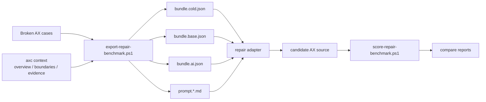

# AX Benchmark Showcase

> 这页回答一个很具体的问题：AX 现在已经能复现什么证据，证据怎么跑，哪些结论还不能越界说。

AX 的 benchmark 不是宣传页，而是项目的验证层。它用固定坏例子、固定导出物、固定 adapter 契约和固定评分脚本，验证一件事：

- 结构化 diagnostics、AI 修复协议和架构上下文，是否真的能进入同一条可复跑的修复链。

下一轮证据展示层是 [`Repair Archaeology v0`](./repair-archaeology.md)：把 replay、score、compare 和 context-enabled export 产物整理成 case 级 JSON / Markdown 修复报告，让外部读者能按单个错误理解“怎么修、哪里失败、如何复现”。

## 当前快照

当前仓库快照：`2026-04-27`

| 项目 | 当前值 |
| --- | --- |
| Full manifest | [`../benchmarks/repair-cases.json`](../benchmarks/repair-cases.json) |
| Smoke manifest | [`../benchmarks/repair-cases-smoke.json`](../benchmarks/repair-cases-smoke.json) |
| Current full cases | `43` |
| Smoke cases | `13` |
| Published deterministic snapshot | `30` cases |
| Compare ladder | `cold -> base -> ai` |
| `cold` replay result | `23/30` |
| `base` replay result | `25/30` |
| `ai` replay result | `30/30` |
| `base -> ai` lift | `+5` repaired cases |
| `base -> ai` lift | `+16.67` percentage points |
| `cold -> ai` lift | `+7` repaired cases |
| Context-enabled export | `-IncludeContext` 已支持 |

这个结果证明的是：AX 仓库内部已经有一条可复现的修复证据链。它还不是跨语言、跨模型、公开 live-model benchmark 的最终结论。

## 证据链结构



当前最重要的新增事实是：`context` 不再只是独立阅读接口。开启 `-IncludeContext` 后，repair bundle 会带上 `context_bundle`，prompt 也会带上 `AX context bundle` 段落。

首批 context 输入壳层固定为：

| View | 作用 | 为什么先选它 |
| --- | --- | --- |
| `overview` | 给 agent 快速定位项目/源码入口、规模、核心 symbol | 低风险、稳定、所有 case 都能消费 |
| `boundaries` | 标出宿主边界使用，如 `fs / process / env / argv` | 防止模型在修复时误动宿主边界 |
| `evidence` | 给出相关 examples / tests / benchmarks / expected artifacts | 把修复自然接回验证链 |

`evidence` 是 symbol-scoped 视图，导出时优先读 manifest 里的 `cases[].context_symbol`，缺省回退到 `main`。

## Case Set

当前 full manifest 有 `43` 个 case，smoke subset 有 `13` 个 case。下表展示的是上一轮已发布的 `30` case deterministic replay 快照；新增的 `Result` 错误传播、包解析、结构化 pattern 等 case 已进入 full manifest 和 shared replay candidate 覆盖，下一次公开 benchmark 刷新时应重新生成 `cold/base/ai` 三档数字。

| Category | Cases | `cold` replay | `base` replay | `ai` replay | 代表 case |
| --- | ---: | ---: | ---: | ---: | --- |
| `syntax` | `3` | `3/3` | `3/3` | `3/3` | `missing_semicolon_basic`, `project_helper_missing_semicolon`, `missing_paren_condition` |
| `semantic` | `19` | `14/19` | `16/19` | `19/19` | `type_mismatch_bool_from_int`, `missing_struct_literal_field`, `slice_assignment_read_only` |
| `runtime` | `5` | `3/5` | `3/5` | `5/5` | `index_out_of_bounds_runtime`, `division_by_zero_runtime`, `missing_file_read_runtime` |
| `module` | `2` | `2/2` | `2/2` | `2/2` | `import_declaration_unsupported`, `module_declaration_unsupported` |
| `unsupported` | `1` | `1/1` | `1/1` | `1/1` | `empty_array_literal_unsupported` |

这批 case 已经覆盖：

- 语法恢复：缺分号、缺括号、project-backed 文件错误
- 语义错误：类型不匹配、缺字段、未知类型、不可变写入、slice 误用
- 运行期错误：数组越界、除零、缺文件、缺目录、子进程非零退出
- 模块与不支持表面：import/module 边界、空数组字面量策略

这不是最终 workload，但已经不只是 `hello world + type mismatch`。

## 方法说明

当前展示结果使用 deterministic replay，而不是直接调用 live model。

| 维度 | 当前设置 |
| --- | --- |
| Export script | [`../scripts/export-repair-benchmark.ps1`](../scripts/export-repair-benchmark.ps1) |
| Runner | [`../scripts/replay-repair-adapter.ps1`](../scripts/replay-repair-adapter.ps1) |
| Score script | [`../scripts/score-repair-benchmark.ps1`](../scripts/score-repair-benchmark.ps1) |
| Feedback compare | [`../scripts/compare-repair-feedback.ps1`](../scripts/compare-repair-feedback.ps1) |
| Mode compare | [`../scripts/compare-repair-modes.ps1`](../scripts/compare-repair-modes.ps1) |
| Passing baseline | [`../benchmarks/repair-candidates/compare/shared`](../benchmarks/repair-candidates/compare/shared) |
| Cold overrides | [`../benchmarks/repair-candidates/compare/cold`](../benchmarks/repair-candidates/compare/cold) |
| Base overrides | [`../benchmarks/repair-candidates/compare/base`](../benchmarks/repair-candidates/compare/base) |
| Attempt budget | 每个 case 每个 mode 一次候选 |
| Pass condition | 修复后 `check` 无诊断；`run` case 还必须不再产生 runtime diagnostics |

为什么先用 replay：

- replay 能把 benchmark 资产、评分脚本和 feedback contract 固定住
- replay 不受 live model 温度、网络、版本漂移影响
- replay 能清楚表达 `cold / base / ai` 三种输入差异

它测的是协议链路是否稳定，不是“某个模型今天表现如何”。

## 当前结果

### Full Compare Replay

| Mode | Passed | Failed | 说明 |
| --- | ---: | ---: | --- |
| `cold` | `23/30` | `7/30` | 只依赖 prompt 与坏源码，不给结构化 diagnostics |
| `base` | `25/30` | `5/30` | 给基础 JSON diagnostics |
| `ai` | `30/30` | `0/30` | 给 `--json --ai` 的 rule_id、repair_goal、fixits、context snippets |

`base -> ai` 当前 lift 来自这些 case：

| Case | Category | 为什么有代表性 |
| --- | --- | --- |
| `type_mismatch_bool_from_int` | `semantic` | 需要明确 declared type 与 initializer 的修复方向 |
| `missing_struct_literal_field` | `semantic` | 需要知道 struct literal 缺哪一个字段 |
| `slice_assignment_read_only` | `semantic` | 需要知道 slice 是只读 view，应该改原数组或改策略 |
| `index_out_of_bounds_runtime` | `runtime` | `check` 已通过，修复必须理解 runtime bounds |
| `division_by_zero_runtime` | `runtime` | `check` 已通过，修复必须理解 runtime divisor 约束 |

`cold -> ai` 额外 lift 来自：

| Case | Category | 说明 |
| --- | --- | --- |
| `len_builtin_non_countable_value` | `semantic` | 需要知道 `len` 的合法输入族 |
| `unknown_type_missing` | `semantic` | 需要把未知类型替换为已声明类型，或补声明 |

## Context-Enabled Export

开启 context bundle：

```powershell
powershell -NoProfile -ExecutionPolicy Bypass -File .\scripts\export-repair-benchmark.ps1 `
  -ManifestPath benchmarks\repair-cases-smoke.json `
  -OutputDir .ax-ai\repair-benchmark\context-smoke `
  -IncludeContext `
  -SkipBuild
```

导出的 `bundle.ai.json` 会出现：

```json
{
  "schema_version": 1,
  "case_id": "project_helper_missing_semicolon",
  "feedback_mode": "ai_json",
  "context_bundle": {
    "schema_version": 1,
    "target": "benchmarks/repair-projects/helper_missing_semicolon",
    "symbol": "main",
    "views": {
      "overview": { "schema_version": 1, "view": "overview" },
      "boundaries": { "schema_version": 1, "view": "boundaries" },
      "evidence": { "schema_version": 1, "view": "evidence" }
    }
  }
}
```

这一步的意义很大：AX 的护城河不再是几份孤立文档，而是进入同一条机器可消费链路。

| 链路输入 | 是否已在 bundle/prompt 中成立 |
| --- | --- |
| Broken source | 是 |
| Project snapshot | project-backed case 已支持 |
| Base diagnostics | 是 |
| AI repair contract | 是 |
| Context bundle | `-IncludeContext` 开启后支持 |
| Scoring / compare | 是 |

## 失败样例说明

当前展示页必须保留失败样例，因为 AX 不能把 benchmark 做成只报喜不报忧。

### `slice_assignment_read_only`

坏例子：

```ax
fn main() -> i32 {
    let values: [i32; 3] = [1, 2, 3];
    let mut view: [i32] = values[0:2];
    view[0] = 9;
    return 0;
}
```

基础 diagnostics 能说清楚“slice 只读，不能通过 `view` 写入”。AI-enhanced diagnostics 进一步给出：

- `rule_id: slice_values_are_read_only`
- 明确 repair goal
- 相关 span
- rule card
- fixits

这个 case 在 `base` replay 中保持失败，在 `ai` replay 中修复成功。它代表 AX 想证明的核心差异：不是报错文字更长，而是修复目标更窄、修改半径更明确。

### Runtime cases

`index_out_of_bounds_runtime` 和 `division_by_zero_runtime` 的价值在于：它们已经通过 `check`，失败发生在 `run`。这说明 AX 的 repair benchmark 不只测 parser/semantic，也把 runtime diagnostics 纳入同一套 AI 修复协议。

## 复现命令

先确保 `axc` 已编译：

```powershell
powershell -NoProfile -ExecutionPolicy Bypass -File .\scripts\cargo-gnu.ps1 build
```

导出 full benchmark：

```powershell
powershell -NoProfile -ExecutionPolicy Bypass -File .\scripts\export-repair-benchmark.ps1 `
  -ManifestPath benchmarks\repair-cases.json `
  -OutputDir .ax-ai\repair-benchmark\showcase-current `
  -SkipBuild
```

导出 context-enabled smoke benchmark：

```powershell
powershell -NoProfile -ExecutionPolicy Bypass -File .\scripts\export-repair-benchmark.ps1 `
  -ManifestPath benchmarks\repair-cases-smoke.json `
  -OutputDir .ax-ai\repair-benchmark\showcase-context-smoke `
  -IncludeContext `
  -SkipBuild
```

复现 `base -> ai` 对比：

```powershell
powershell -NoProfile -ExecutionPolicy Bypass -Command "& { `
  .\scripts\compare-repair-feedback.ps1 `
    -BenchmarkDir '.ax-ai\repair-benchmark\showcase-current' `
    -RunnerScript '.\scripts\replay-repair-adapter.ps1' `
    -RunnerExtraArgs @('-SourceDir', '.\benchmarks\repair-candidates\compare\shared', '-SourceDirBase', '.\benchmarks\repair-candidates\compare\base') `
    -OutputDir '.ax-ai\repair-comparisons\showcase-current' `
    -SkipBuild `
}"
```

复现 `cold -> base -> ai` 对比：

```powershell
powershell -NoProfile -ExecutionPolicy Bypass -Command "& { `
  .\scripts\compare-repair-modes.ps1 `
    -BenchmarkDir '.ax-ai\repair-benchmark\showcase-current' `
    -RunnerScript '.\scripts\replay-repair-adapter.ps1' `
    -RunnerExtraArgs @('-SourceDir', '.\benchmarks\repair-candidates\compare\shared', '-SourceDirCold', '.\benchmarks\repair-candidates\compare\cold', '-SourceDirBase', '.\benchmarks\repair-candidates\compare\base') `
    -OutputDir '.ax-ai\repair-mode-comparisons\showcase-current' `
    -SkipBuild `
}"
```

结果文件：

- `.ax-ai\repair-comparisons\showcase-current\comparison.json`
- `.ax-ai\repair-mode-comparisons\showcase-current\comparison.json`

底层流程见 [`repair-benchmark.md`](./repair-benchmark.md)，adapter 契约见 [`repair-adapter-spec.md`](./repair-adapter-spec.md)。

## 目前已经证明什么

当前证据已经能证明：

- AX 有稳定 repair case manifest
- AX 能导出 `cold / base / ai` 三种修复输入
- `--json --ai` 比 base diagnostics 提供更多可机器消费的修复信息
- replay compare 能稳定复现 `base -> ai` 的 lift
- context bundle 已经能进入 repair export 链路
- runtime diagnostics 已经纳入修复 benchmark，不只测静态错误

## 目前还没有证明什么

当前证据不能越界说：

- 不能说 AX 已经战胜 Rust / Go / Python 子集
- 不能说 AX 对所有 coding model 都有稳定收益
- 不能说 live model benchmark 已经完成
- 不能说当前 case 集已经代表真实世界所有任务
- 不能说 `context_bundle` 已经完成最终效果评估；它目前完成的是输入链路，不是收益结论

所以当前最严谨的对外说法是：

> AX 已经拥有可复现的仓库内 repair evidence loop，并且已把 structured diagnostics、AI repair contract 与 context bundle 接进同一条修复输入链。

如果需要对外引用更完整的项目表述边界，见 [`public-claims.md`](./public-claims.md)。

## 下一步公开证明

下一批 benchmark 要从“仓库内 replay 证据”升级到“外部可比较证据”：

1. 固定 `10-20` 个 cross-language 小任务。
2. 选择 AX、Rust subset、Go subset、TypeScript/Python subset 做对照。
3. 固定同一个模型、同一轮数、同一工具权限。
4. 测 `pass@1`、单轮修复率、平均回合数、输入/输出 token、格式漂移率。
5. 单独做一组 `with context_bundle / without context_bundle` A/B。

这一步完成前，AX 的公开表述必须继续区分：

- 仓库内已复现事实
- 外部尚未完成对照
